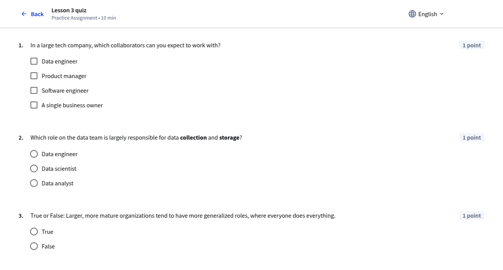

## Module 1: Data and Data analyst role

[Slides](./C1_M1.pdf)

### Introduction

🎥 [W1 1.1 welcome to data analytics](https://www.youtube.com/watch?v=6-OPW9nBkV4)  
🎥 [W1 1.2 generative ai in this course](https://www.youtube.com/watch?v=S0nL2FLmFm4)  
🎥 [W1 1.3 module 1 introduction](https://www.youtube.com/watch?v=9Rdeqp4DRFQ)  
🎥 [W1 1.4 life as a data analyst](https://www.youtube.com/watch?v=BP4uLjXLNfM)  

-----

### What is Data Analytics?
🎥 [W1 2.1 what is data analytics](https://www.youtube.com/watch?v=Iq42gg3uRuY)  
🎥 [W1 2.2 evidence based decision making](https://www.youtube.com/watch?v=V96AD7tnLkk)  
🎥 [W1 2.3 a history of data analytics](https://www.youtube.com/watch?v=vN4_C7AP4js)  
🎥 [W1 2.4 modern industry use cases](https://www.youtube.com/watch?v=VqinrA_i1ZQ) 

**Lesson 1 quiz**  
  

-----

### What is Data?

🎥 [W1 3.1 defining data](https://www.youtube.com/watch?v=PUwY40nD9SM)  
🎥 [W1 3.2 unstructured data](https://www.youtube.com/watch?v=eso9nDkXbqc)  
🎥 [W1 3.3 structured data](https://www.youtube.com/watch?v=IFGCEeWFZKw)  
🎥 [W1 3.4 big data](https://www.youtube.com/watch?v=9rCzfG-SZao)  

**Lesson 2 quiz**
  

**Practice Lab: E-commerce sales**  
Q1) Is the data cross-sectional or time series?
- [ ] Time series  
- [x] Cross-sectional  

Q2) How would you best classify the data in the Quantity column?
- [ ] Unstructured  
- [ ] Structured, Categorical  
- [ ] Structured, Numerical - Continuous  
- [x] Structured, Numerical - Discrete  

Q3) How would you best classify the data in the ProductNo column?
- [ ] Unstructured  
- [x] Structured, Numerical - Discrete  
- [ ] Structured, Numerical - Continuous  
- [ ] Structured, Numerical - Date  

Q4) How would you best classify the data in the Country column?
- [ ] Unstructured  
- [x] Structured, Categorical  
- [ ] Structured, Numerical - Discrete  
- [ ] Structured, Numerical - Date  

Q5) How would you best classify the data in the TransactionNo column?
- [ ] Unstructured  
- [ ] Structured  
- [x] Structured, Numerical - Discrete  
- [ ] Structured, Numerical - Date  

Q6) How would you best classify the data in the CustomerNo column?
- [ ] Unstructured  
- [ ] Structured  
- [x] Structured, Numerical - Discrete  
- [ ] Structured, Numerical - Date  

Q7) How would you best classify the data in the Price column?
- [ ] Unstructured  
- [ ] Structured, Categorical  
- [x] Structured, Numerical - Continuous  
- [ ] Structured, Numerical - Date  

Q8) How would you best classify the data in the ProductName column?
- [ ] Unstructured  
- [x] Structured  
- [ ] Numerical - Continuous  
- [ ] Numerical - Discrete  
- [ ] Structured, Numerical - Date

-----

### The data analytics role in context

🎥 [W1 4.1 data ecosystems](https://www.youtube.com/watch?v=Nmt7IcDjOW8)  
🎥 [W1 4.2 collaborators outside your data team](https://www.youtube.com/watch?v=CnDR4nCqW0A)  
🎥 [W1 4.3 collaborators on your data team](https://www.youtube.com/watch?v=2GzezDhB26g) 

**Lesson 3 quiz**

-----

### Large Language Models for Data Analytics

🎥 [W1 5.1 introduction to large language models](https://www.youtube.com/watch?v=bnRaQxSgf3c)  
🎥 [W1 5.2 choosing an llm](https://www.youtube.com/watch?v=E5WUi-2-248)  
🎥 [W1 5.3 prompting llms](https://www.youtube.com/watch?v=5SzG45JmuQM)  
🎥 [W1 5.4 llm limitations](https://www.youtube.com/watch?v=8g01sBppE9g)  
🎥 [W1 5.5 demo interacting with llms](https://www.youtube.com/watch?v=ScNHLVkt2r8) 

**Lesson 4 quiz**

-----

### Graded Quiz

Q1) There are three ways of making decisions: by chance, by intuition and evidence-based. Which one of the three is used in data analytics?
- [x] Evidence-based  
- [ ] By chance  
- [ ] By intuition  

Q2) True or False: It's possible to make the correct decision relying purely on luck or intuition.
- [ ] True  
- [x] False  

Q3) Which of the following is an example of using data analytics to drive decision making?
- [x] Analyzing a heatmap of clicks on a website to improve the user experience on that website.  
- [ ] Selecting baseball players for a team based on the "eye test".  
- [ ] Placing military radar equipment at random, then moving the least useful ones to another random position.  
- [ ] Deciding how to improve your pet shop business based on a gut feeling.  

Q4) True or False: Every company needs to constantly reinvent itself to stay in business.
- [x] True  
- [ ] False  

Q5) Which of the following is an example of structured data?
- [x] A spreadsheet containing the name, age and size of all of the contestants of a cat show.  
- [ ] A collection of cat videos.  
- [ ] Images of cats.  
- [ ] A novel about the life of a cat.  

Q6) True or False: Cross-sectional data tracks changes over time.
- [ ] True  
- [x] False  

Q7) Which of the following is true about small data?
- [x] It is easier to run on less powerful computers such as your laptop at home.  
- [ ] Unlike big data, small data cannot provide useful insights.  
- [ ] Small datasets are often generated with high velocity, volume, and variety.  
- [ ] There is no significant difference between dealing with small data and big data.  

Q8) Which are the five main stages of the flow of data in a data ecosystem?
- [ ] Collection  
- [ ] Storage  
- [ ] Processing  
- [ ] Analysis  
- [ ] Delivery  
- [x] (Correct options are Collection, Storage, Processing, Analysis, and Delivery)  

Q9) Which of the following is true about the role of the data engineer?
- [x] The main task of data engineers is typically collection and storage of data.  
- [ ] Data engineers spend a significant proportion of their time analyzing the data using advanced statistical techniques.  
- [ ] Data engineers do not have any overlapping tasks with data analysts and data scientists.  
- [ ] If there are enough data engineers on the team, the team does not need any data analysts.  

Q10) What are some of your responsibilities as a data analyst when dealing with the main stakeholders of the project (such as the business owner)? Select all that apply.
- [x] Understanding the business problem they need to solve  
- [x] Providing insights and analysis to help inform decisions  
- [ ] Making the final business decisions based on insights  

Q11) Which of the following is a best practice for prompting a Large Language Model (LLM)?
- [x] Iterating on prompts by getting started quickly, checking if the results are right, then adjusting the prompt to get closer to your ideal response.  
- [ ] Using the shortest possible prompts (ideally only a handful of words) so that the LLM can do most of the work.  
- [ ] Trusting that the LLM's response is factually correct unless the LLM tells you otherwise.  
- [ ] Asking the LLM about knowledge domains you're not an expert in, even if you don't have a way of verifying whether its response is correct.  

Q12) True or False: Even though they are computer programs, LLMs can be biased.
- [x] True  
- [ ] False  

### Graded Lab

Q1) Which of the following columns in the purchase_log file correspond to categorical data?
   - [ ] Order Number  
   - [ ] Time of Purchase  
   - [ ] Chicken Wings  
   - [x] Payment Method  
   - [ ] Delivery Address  

Q2) Which of the following columns in the purchase_log file correspond to unstructured data?  
   - [ ] User ID  
   - [ ] Total Amount  
   - [ ] Payment Method  
   - [x] Delivery Instructions  
   - [x] Special Requests  

Q3) The current survey is formulated as 4 open-ended questions, so users enter text for each answer. This data is hard to process because it is unstructured. You plan to revise the survey to retrieve more structured data while allowing for similar insights. Select the two survey changes that will help you achieve your goals.  
   - [x] Rewrite the open-ended questions so they ask for a 1 to 5 rating instead of text.  
   - [x] Add a checkbox question where customers can select from a defined list of improvements they would like.  
   - [ ] Remove question 3 on the survey.  
   - [ ] Stop collecting the order number and user ID on the survey.  

Q4) In the purchase_log spreadsheet, consider the "Delivery Instructions" and "Special Requests" columns. Which measures could you take to reduce the amount of unstructured data you need to process? Select all that apply.  
   - [x] Create a new input area on the order form for the gate code.  
   - [ ] Add a new column called "Explain your allergies" where customers write down any allergies they have.  
   - [x] Add a checkbox on the order form for "Extra napkins."  

Q5) Which of the following columns in the survey_answers file corresponds to unstructured data?  
   - [ ] User ID  
   - [ ] Order Number  
   - [x] Q1: Can you describe your overall experience with ordering from Slice of Heaven through our delivery app?  
   - [x] Q2: How would you rate the quality of the food you received?  
   - [x] Q3: How was the interaction with the delivery driver?  
   - [x] Q4: Is there anything else you would like to share about your experience with Urban Xpress or our delivery app?  

Q6) You believe that forecasting the number of online orders at any given time would help identify the best days and times to offer promotions. However, you’re not yet experienced in creating advanced statistical models to make these types of predictions. Who should you consult with to solve this problem?  
   - [ ] The data engineer  
   - [ ] The restaurant owner  
   - [x] A data scientist  

Q7) Which of the following variables in the reviews file corresponds to structured data?  
   - [x] Rating  
   - [ ] Comment  
   - [ ] Attachment 1  
   - [ ] Attachment 2  

Q8) The owner is considering two promotions: including free garlic bread with every online order and giving a 10% discount on orders above $50. After analyzing the different data sources, you discover that garlic bread is a top-selling item on the app. You believe that this information could help decide between these two promotions. Who should you present this insight to?  
   - [ ] Data engineer  
   - [x] The restaurant owner  
   - [ ] A data scientist  

Q9) You believe you can conduct more useful analyses if the restaurant starts tracking delivery complaints from customers, so you'd like to start collecting and storing that data. Who should you talk to about this request?  
   - [x] The data engineer  
   - [ ] The restaurant owner  
   - [ ] A data scientist  

Q10) Which of the following columns in the purchase_log file correspond to discrete numerical data?  
  - [x] User ID  
  - [x] Order Number  
  - [x] Cheesecake  
  - [ ] Total Amount  

Q11) Which of the following columns in the purchase_log file correspond to continuous numerical data?  
  - [ ] User ID  
  - [ ] Veggie Pizza  
  - [x] Total Amount  
  - [ ] Payment Method  
  - [ ] Delivery Instructions  

Q12) True or false: The data in the survey_answers spreadsheet corresponds to cross-sectional data.  
  - [x] True  
  - [ ] False  

-----
-----
