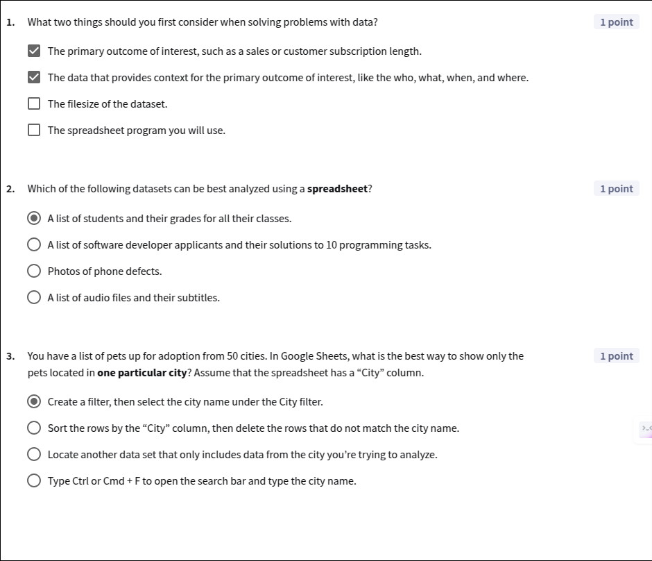
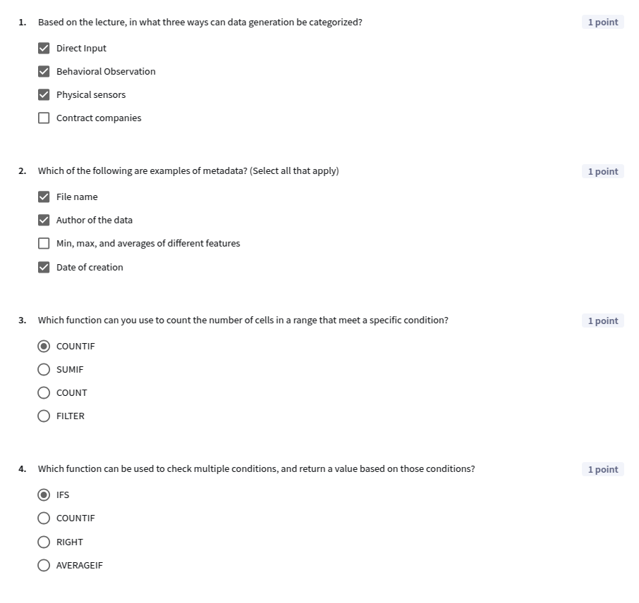
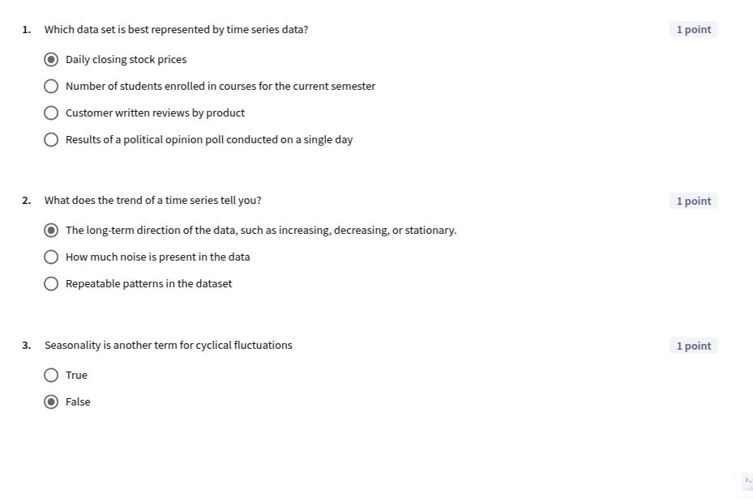

## Module 2: Using Spreadsheets for Data Analytics

[Slides](./C1_M2.pdf)

### Introduction
🎥 [W2 1.1 module 2 introduction](https://www.youtube.com/watch?v=2ayIDZ3GsGE)  

----

### How spreadsheet organize data

🎥 [W2 2.1 solving problems with data](https://www.youtube.com/watch?v=QetVx_uG-Rg)  
🎥 [W2 2.2 spreadsheets for business analytics](https://www.youtube.com/watch?v=M7FZDF0HfT8)  
🎥 [W2 2.3 navigating google sheets](https://www.youtube.com/watch?v=6MHk4kAYKNk)  
🎥 [W2 2.4 importing data](https://www.youtube.com/watch?v=NjRfYYfPqGw)  
🎥 [W2 2.5 sorting filtering and formatting](https://www.youtube.com/watch?v=Uxz1HFHqg6k) 

**Lesson 1 Quiz**

-----

### Spreadsheet Fundamentals

🎥 [W2 3.1 getting to know your data](https://www.youtube.com/watch?v=U_m-vYlh0Cc)  
🎥 [W2 3.2 summary statistics max min average](https://www.youtube.com/watch?v=yA10DtRS0cc)  
🎥 [W2 3.3 conditional formatting](https://www.youtube.com/watch?v=hAoMLodTzxg)  
🎥 [W2 3.4 summary statistics countif](https://www.youtube.com/watch?v=QPf6h-a0BpQ)  
🎥 [W2 3.5 summary statistics sumif averageif](https://www.youtube.com/watch?v=g5sjefB56PI)  
🎥 [W2 3.6 summary statistics countifs sumifs](https://www.youtube.com/watch?v=l2vf3_1ziug)  
🎥 [W2 3.7 data processing if ifs right left](https://www.youtube.com/watch?v=qIO9Y-OEzL8)  
🎥 [W2 3.8 where does data come from](https://www.youtube.com/watch?v=ujWgI7BlleM)  

**Lesson 2 quiz**

**Practice Lab: Exploring the Hotel Reservations dataset**
[C1M2_PracticeLab_1_Exploring_Hotel_Reservations](https://docs.google.com/spreadsheets/d/1pYw2wpRWWXt0eP-u9yJQcZISRd-u48jZULRCml2gqxM/edit?usp=sharing)

----

### Data Exploration with LLMs

🎥 [W2 4.1 data exploration with llms](https://www.youtube.com/watch?v=Ja4PneWfRtU)  

**Practic Lab: Using an LLM for epxloration**

----

### Time Series Data

🎥 [W2 5.1 introduction to time series](https://www.youtube.com/watch?v=pd66omz8o50)  
🎥 [W2 5.2 real world time series](https://www.youtube.com/watch?v=3kYzidr3tqE)  
🎥 [W2 5.3 moving averages](https://www.youtube.com/watch?v=V2OLkHsaDDM)  
🎥 [W2 5.4 percent change](https://www.youtube.com/watch?v=4WzkSYc7mbU)  

**Lesson 4 quiz**

**Practice Lab: Exploring baby names**  

📊 [C1M2_PracticeLab_3_Exploring_Baby_Names](https://docs.google.com/spreadsheets/d/1XxVtrRxs3hRdJItuCJ4oHLOxt2h9eONXFK3oQK7nv7c/edit?usp=sharing)
-----

### Graded Quiz

Q1) What is the first key step when selecting data for analysis?  
   - [ ] Randomly selecting data points  
   - [x] Identifying the outcome of interest  
   - [ ] Gathering data that provides context  
   - [ ] Selecting data based on personal preferences  

Q2) What is metadata in the context of data analysis?  
   - [ ] The primary data used for analysis  
   - [ ] An algorithm for data processing  
   - [x] Data about your data  
   - [ ] A type of data visualization  

Q3) Which of the following are techniques you can use when working with LLMs to explore a dataset? (Select all that apply)  
   - [ ] Upload sensitive data like names and social security numbers only if it helps your analysis.  
   - [x] Ask specific questions about the data.  
   - [x] Upload the dataset to the LLM.  
   - [ ] Use short prompts to avoid overwhelming the LLM.  

Q4) What is time series data primarily concerned with?  
   - [ ] Analyzing data at irregular intervals  
   - [x] Measuring outcomes over fixed time periods  
   - [ ] Collecting random data points  
   - [ ] Measuring different outcomes at a single time point  

Q5) One of the main benefits of conditional formatting is that it provides a visual layer on top of your data. What does this help you accomplish?  
   - [ ] Automatically correct errors in your data  
   - [ ] Generate statistical summaries of your data  
   - [x] Quickly identify patterns and trends in the data  
   - [ ] Eliminate the need for any other data analysis tools  

Q6) Where does 1st party data come from?  
   - [x] It is owned by you or your company directly  
   - [ ] It is collected for the general purpose of selling to multiple buyers  
   - [ ] It is collected by another company as their own data and shared with you  
   - [ ] It is public government data released for research purposes  

Q7) Which function would you use to add up all the values in cells that meet a specific condition?  
   - [ ] COUNTIF  
   - [x] SUMIF  
   - [ ] AVERAGEIF  
   - [ ] IFS  

Q8) Which of the following features could provide context for sales data? (Select all that apply)  
   - [x] The customer ID of the purchasing customer  
   - [x] The product being purchased  
   - [ ] A list of anonymous reviews for the business  
   - [x] The purchase date  

Q9) What are the characteristics of the simple moving average? (Select all that apply)  
   - [x] The more points in the window, the smoother the curve will be.  
   - [x] It calculates the average outcome across several consecutive time periods.  
   - [ ] It completely removes the noise in a dataset.  
   - [x] It involves sliding a window of N units along the data.  

Q10) Which type of data are spreadsheets specifically designed to work with?  
   - [x] Structured data  
   - [ ] Raw data  
   - [ ] Unstructured data  
   - [ ] Complex data  

Q11) What is the first step in understanding your data?  
   - [x] Knowing the data’s source.  
   - [ ] Visualizing the data.  
   - [ ] Applying statistical tests.  

-----

### Graded Lab

**Q1**: Check all the answers that represent numerical columns in the video games dataset.  
- [ ] Platform  
- [x] NA_Sales  
- [ ] Publisher  
- [ ] Genre  
- [x] EU_Sales  

**Q2**: How many rows are there in the filtered video games dataset (check “Exercise 1 - Filtering”)?  
- **Answer**: 204  

**Q3**: What is the release date of the newest games in the filtered dataset? Use YYYY-MM-DD format.  
- **Answer**: 2018-12-07  

**Q4**: What is the earliest release date of any game in the filtered dataset? Use YYYY-MM-DD format.  
- **Answer**: 2018-01-01  

**Q5**: In which region did video games sell the best? Write the full name of the continent or country.  
- **Answer**: North America  

**Q6**: From the top 3 Publishers, which one had the highest number of games?  
- **Answer**: Electronic Arts  

**Q7**: How many million more sales did the top genre have compared with the second genre?  
- [x] Action-Adventure games had 7.77 M more global sales than Sports.  
- [ ] Action-Adventure games had 0.17 M more global sales than Sports.  
- [ ] Action-Adventure games had identical sales compared with Sports.  
- [ ] Action-Adventure games had 140.29 M more global sales than Sports.  

**Q8**: When did the highest fluctuation in peak player count occur (enter in YYYY-MM format)? Check “Exercise 4 - GTA V” for answers.  
- **Answer**: 2017-12  

**Q9**: Excluding the behavior of users in the first few months, is there a generally positive, negative, or stationary trend of the number of users for GTA V? Check “Exercise 4 - GTA V” for answers.  
- [x] Positive trend.  
- [ ] Negative trend.  
- [ ] Stationary trend.  

**Q10**: What is the difference between the line chart of the peak player counts compared with the line chart of the moving average of peak player counts?  
- [x] The line for the moving average is smoother, showing a single peak around March 2020.  
- [ ] The line for the moving average has a negative trend, while the line for the peak player count has a positive trend.  
- [ ] The moving average shows the seasonality of the GTA player count more distinctly compared with the line for peak player count.  
- [ ] The moving average does not show the sharp dropoff in the first few months, while the line for peak player count does.  

------
------
