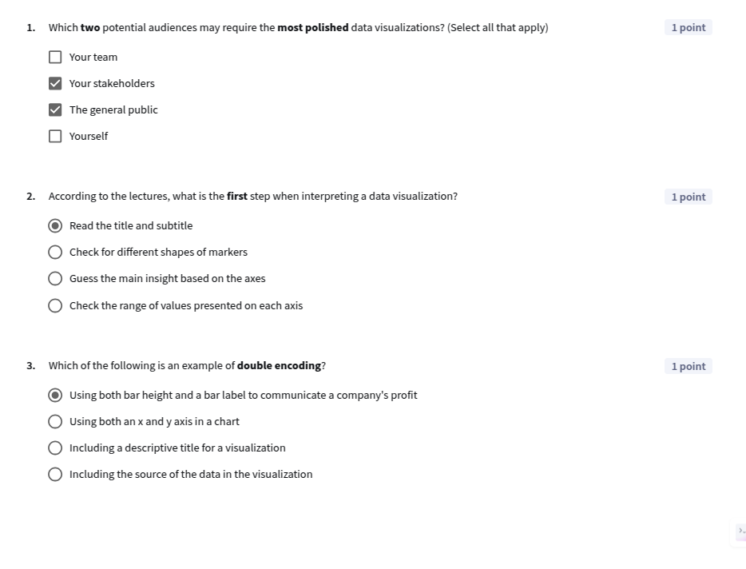
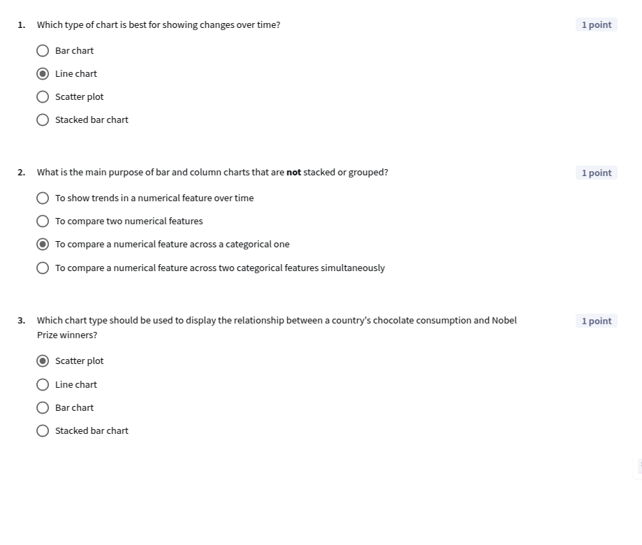
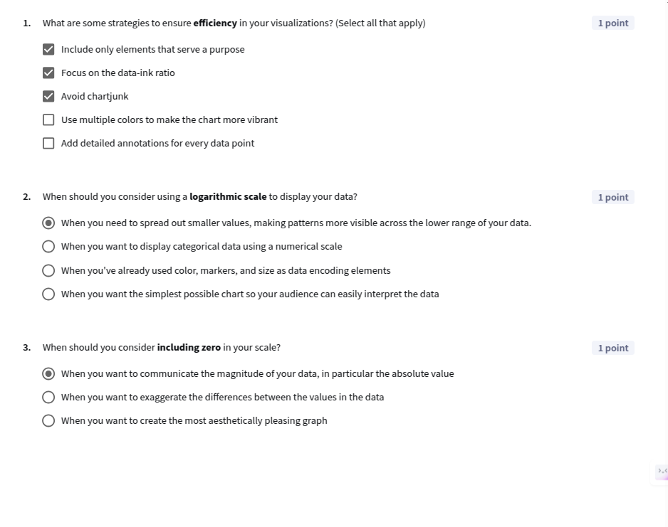
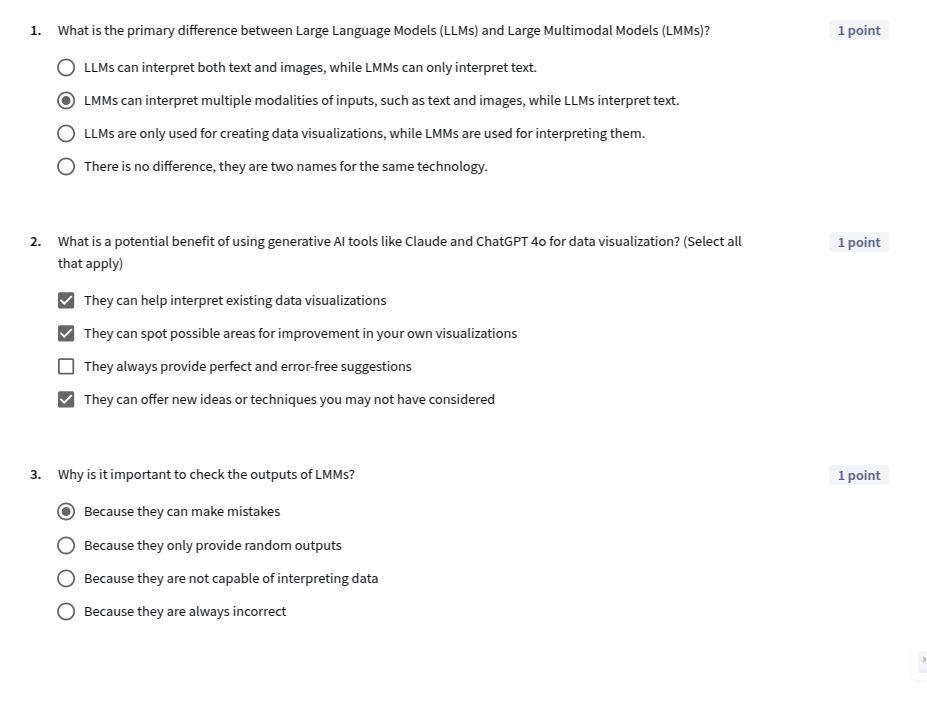

## Module 3: Data Visualization in spreadsheets

[Slides](./C1_M3.pdf)

### Introduction

🎥 [W3 1.1 module 3 introduction](https://www.youtube.com/watch?v=s13064RCx_Q) 

-----

### Data Storytelling
🎥 [W3 2.1 what is data storytelling](https://www.youtube.com/watch?v=7OjiwzxC1GM)  
🎥 [W3 2.2 the language of data visualizations](https://www.youtube.com/watch?v=TVE6TPIv2i8)  
🎥 [W3 2.3 analyzing visualizations](https://www.youtube.com/watch?v=YeudF97B9ko)  

**Lesson 1 quiz**

----

### Creating charts
🎥 [W3 3.1 the right chart for the right insight](https://www.youtube.com/watch?v=6gwTbul0riM)  
🎥 [W3 3.2 demo bar column charts](https://www.youtube.com/watch?v=KvzKOcxaXjo)  
🎥 [W3 3.3 demo customizing charts](https://www.youtube.com/watch?v=JNgU5Gas4TI)  
🎥 [W3 3.4 demo scatter plots](https://www.youtube.com/watch?v=jlnKpOUYOH8)  
🎥 [W3 3.5 demo grouped bar column charts](https://www.youtube.com/watch?v=obNCbYcoT_0)  
🎥 [W3 3.6 demo stacked bar column charts](https://www.youtube.com/watch?v=fHKoT2Cw8Y0)  
🎥 [W3 3.7 demo line charts](https://www.youtube.com/watch?v=vh-qwPeva74)  

**Lesson 2 quiz**

**Practice Lab: Exploring hotel reservations**
[C1M3_PracticeLab_1](https://docs.google.com/spreadsheets/d/1WX8-hxluQFicjXKPajugS6uNqNLrv347Tr60nD7GSCw/edit?usp=sharing)

----

### Best Practise in Data Visualization
🎥 [W3 4.1 strategies for effective data visualization](https://www.youtube.com/watch?v=n77vw2PuzM8)  
🎥 [W3 4.2 data encoding](https://www.youtube.com/watch?v=yR0DMBzVrc8)  
🎥 [W3 4.3 chart elements](https://www.youtube.com/watch?v=Rl6cOTebMnY)  
🎥 [W3 4.4 data visualization examples the good and the better](https://www.youtube.com/watch?v=QSVedqu4Wus) 

**Lesson 3 quiz**

-----

### Data Visualization with LLMs
🎥 [W3 5.1 demo interpreting data visualizations with llms](https://www.youtube.com/watch?v=sy44dOPJ_6g)  
🎥 [W3 5.2 demo creating data visualizations with llms](https://www.youtube.com/watch?v=k6YMaQIQl9M)  

**Lesson 4 quiz**

-----

### Graded Quiz

**Q1**: Data storytelling enhances the communication of data insights. It involves:  
- [ ] Creating data visualizations with the most aesthetic appeal  
- [ ] Presenting all available data for the sake of completeness  
- [x] Translating data into meaningful insights for your audience using descriptive statistics and visualizations.  
- [ ] Always explaining the data in the simplest possible way, even if your audience has a lot of domain expertise  

**Q2**: What is the role of the legend in a data visualization?  
- [ ] To provide a summary of the data analysis  
- [ ] To show the data source  
- [ ] To provide the title of the chart  
- [x] To explain how different categories in the data are encoded  

**Q3**: According to the lectures, in which order should you examine the chart elements to interpret a chart most effectively?  
- [ ] Big picture → Title → Encoded categories → Annotations → Axes  
- [ ] Annotations → Title → Big picture  
- [x] Title → Axes → Encoded categories → Annotations → Big picture  
- [ ] There is no set order of steps, since different types of charts should be approached differently.  

**Q4**: What is the best technique for assessing whether a data visualization you have created is clear?  
- [ ] Making sure that each element of the chart is explained in depth with thorough annotation, labeling, and live explanation  
- [x] Sharing your visualization with your manager, peers, and/or trusted stakeholders to get their feedback  
- [ ] Ask an LMM whether your data visualization is easy to interpret  
- [ ] Remove extra elements of the chart, like gridlines, axes, and labels  

**Q5**: What should you consider when choosing the type of data visualization to display a particular insight? (Select all that apply)  
- [x] The types of data you are working with  
- [ ] The number of people on your team  
- [x] The audience who will be looking at the visualization  
- [ ] The time of day the report will be presented  
- [x] The primary message you want to get across  
- [x] How the data points relate to each other  

**Q6**: Which type of chart is best for visualizing the number of books sold by genre in a bookstore?  
- [ ] Line chart  
- [x] Bar chart  
- [ ] Scatter plot  
- [ ] Stacked bar chart  

**Q7**: What are some strategies to ensure clarity in your visualizations? (Select all that apply)  
- [x] Choose the appropriate chart type for your data  
- [ ] Use a logarithmic scale to make your charts seem more sophisticated  
- [x] Avoid unnecessary complexity  
- [x] Use clear labels and titles  
- [x] Be consistent with color schemes, fonts, and scales  
- [ ] Use 3D effects to make the chart more interesting  

**Q8**: Identify the two most important reasons why is it important to consider individuals with colorblindness when developing data visualizations.  
- [ ] Because colorblindness is a temporary condition that affects nearly all people at some point in their lives  
- [x] Because additional clarity helps everyone  
- [x] Because about 4.5% of all people worldwide have some form of colorblindness (about 300,000,000 people)  
- [ ] Because designing for colorblind individuals requires removing all colors from visualizations  

**Q9**: Which of the following factors should you consider when deciding whether to use a logarithmic scale? (Select all that apply)  
- [ ] The aesthetic appeal of the logarithmic scale compared with a linear one  
- [x] The audience's ability to interpret a logarithmic scale  
- [x] The balance between storytelling value and added complexity  
- [x] The range and distribution of the data points  

**Q10**: Which priority is most important when creating a chart title?  
- [ ] Creating a jazzy title that catches the audience’s interest and attention  
- [ ] Keeping the title as generic as possible to avoid distracting from the data and giving away the story  
- [ ] Listing the data points and features captured in the chart  
- [x] Highlighting your key insight or providing crucial context, like time period or location  

**Q11**: Which of the following best describes the capabilities of Large Multimodal Models (LMMs)?  
- [x] They can interpret multiple types of inputs, such as text and images, and assist in creating data visualizations.  
- [ ] They can only process text inputs and perform simple calculations.  
- [ ] They can interpret images but cannot assist in creating data visualizations.  
- [ ] They are a sophisticated technology that always creates and interprets visualizations correctly.  

**Q12**: True or False: You can always trust the output of a Large Multimodal Model (LMM).  
- [ ] True  
- [x] False  

----

### Graded Lab
[C1M3_GradedLab](https://docs.google.com/spreadsheets/d/1lQAurvQo5Ng9st8R9qKmuUWPMtQcG-fyBHfVcPXdJaA/edit?usp=sharing)

**Q1**: Is this dataset a time series or is it cross-sectional?  
- [x] Time series  
- [ ] Cross sectional  

**Q2**: Which is the highest number of total rentals for one day?  
- **Answer**: 8714  

**Q3**: Which statement is true about temperature and humidity compared with the weather situation?  
- [ ] Weather situation 3 has the highest humidity and a range of temperatures roughly between 0.2 and 0.7.  
- [x] It's easy to tell the weather situation based on the temperature alone.  
- [ ] Weather situations 1 and 3 have similar patterns of humidity.  
- [ ] The outlier with 0 humidity comes from weather situation 1.  

**Q4**: Review the definition for the weather situation column. Are there any missing categories in the column chart for the number of rides per weather situation? If so, why is that?  
- [ ] Yes, there is one missing label. On the days with the missing weather situation, there were 0 rides reported.  
- [x] Yes, there is one missing label. There were no days in the data set with the missing weather situation.  
- [ ] No, all the values are present in the graph.  

**Q5**: What is the total number of rentals of the point with the lowest humidity in the rentals and humidity scatter plot?  
- **Answer**: 623  

**Q6**: Which season has the lowest number of total rentals?  
- [x] Winter (end of December to early March)  
- [ ] Fall (end of September through early December)  
- [ ] Spring (end of March through early June)  
- [ ] Summer (end of June through early September)  

**Q7**: Which two of the following statements about usage patterns are correct?  
- [x] There is an increasing trend in the total amount of rentals from 2011 to 2012.  
- [x] Most rentals come from registered users.  
- [ ] Registered users and casual users have different seasonal patterns.  
- [ ] There are more than 10 days where the total number of rentals was below 400.  

**Q8**: Based on the line chart of total rentals and the 10 day moving average, what can you conclude?  
- [x] Both the years 2011 and 2012 show the same seasonal pattern, though 2012 has more rentals overall.  
- [ ] The years 2011 and 2012 show very different seasonal patterns, indicating that customer behavior was diverged across those two years.  
- [ ] The data as a whole shows an overall flat trend, indicating no growth over time in the number of rentals.  
- [ ] The moving average for both the years 2011 and 2012 has significantly more spikes and noise compared with the original data.  

**Q9**: Considering the scatter plots you created for bike rentals across temperature and humidity, which statements are correct?  
- [x] Generally speaking, the higher the temperature, the more bike rentals there are.  
- [ ] Generally speaking, the higher the humidity, the more bike rentals there are.  
- [ ] Both temperature and humidity have a similar relationship with the number of total rides.  
- [ ] Both graphs fit the trend line equally well.  

**Q10**: Take a look at the column chart for the number of rides per weekday. Check all statements that are correct:  
- [ ] Saturdays have the highest number of rides.  
- [ ] The biggest drop in rides is from Thursday to Friday.  
- [x] There is a slight increase in rides as the week progresses from Monday to Friday.  
- [x] The difference between the total number of rides on the highest and lowest days is less than 50,000 rides.  

-----
-----
