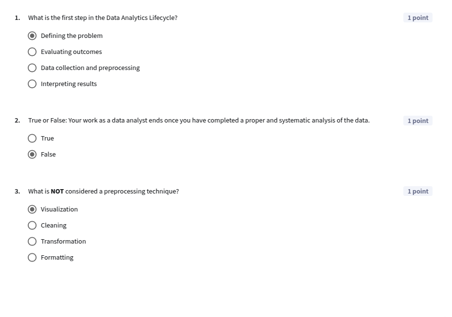
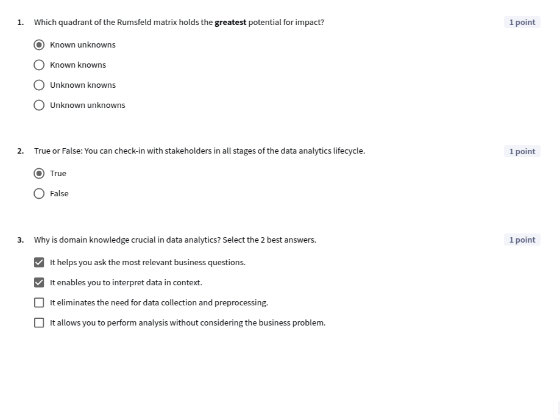

## Module 4: The Data Analytics Lifecycle

[Slides](./C1_M4.pdf)

### Introduction
🎥 [W4 1.1 module 4 introduction](https://www.youtube.com/watch?v=a-N6gCzNbjw)

-----

### The Data Analytics Lifecycle
🎥 [W4 2.1 the data analytics lifecycle](https://www.youtube.com/watch?v=S2dF-aXkPYI)  
🎥 [W4 2.2 defining the problem](https://www.youtube.com/watch?v=VluxqkWZCv4)  
🎥 [W4 2.3 collecting preprocessing data](https://www.youtube.com/watch?v=JWYvIVfV3Aw)  
🎥 [W4 2.4 analyzing data](https://www.youtube.com/watch?v=K-gBI1HwQaM)  
🎥 [W4 2.5 identifying insights](https://www.youtube.com/watch?v=Tiqnchzaatg)  
🎥 [W4 2.6 sharing results](https://www.youtube.com/watch?v=PrBvmwBlUQ4)  
🎥 [W4 2.7 evaluating outcomes](https://www.youtube.com/watch?v=7fOONvw3LrI) 

**Lesson 1 quiz**

-----

### Working with stakeholders

🎥 [W4 3.1 gathering stakeholder requirements](https://www.youtube.com/watch?v=hQbxzOciEjA)  
🎥 [W4 3.2 synthesizing stakeholder input](https://www.youtube.com/watch?v=-pgKRRFQROo)  
🎥 [W4 3.3 checking in with stakeholders](https://www.youtube.com/watch?v=kpnkUC4kwiM)  
🎥 [W4 3.4 domain knowledge](https://www.youtube.com/watch?v=ELJKIAI-5fk)  

**Lesson 2 quiz**

**Spotify case study quiz**

**Q1**: What is the primary objective of the data analysis in this report?  
- [x] To create a playlist that reflects popular music trends and ensures high danceability and energy levels  
- [ ] To assess the energy levels and danceability of the songs  
- [ ] To create a playlist that reflects your unique music taste  
- [ ] To find out which songs are the most streamed songs of 2023  

**Q2**: Where did you get the dataset for the analysis?  
- [x] You downloaded it from Kaggle.  
- [ ] You sourced it directly from Spotify’s website.  

**Q3**: How many columns are there in the dataset?  
- **Answer**: 24  

**Q4**: How many rows are there in the dataset?  
- **Answer**: 953  

**Q5**: True or false: the most streamed song had about 3.7 billion streams.  
- [x] True  
- [ ] False  

**Q6**: The greatest number of songs can be found in which range of number of streams?  
- [x] 0 - 1 billion streams  
- [ ] 1 - 2 billion streams  
- [ ] 2 - 3 billion streams.  

**Q7**: Which columns were used for filtering out music that is suitable for the party?  
- [x] danceability_%  
- [x] energy_%  
- [ ] valence_%  
- [ ] acousticness_%  
- [ ] instrumentalness_%  
- [ ] liveness_%  

**Q8**: How many songs are there in the final playlist after filtering?  
- **Answer**: 101  

-----

### LLMs for Stakeholder Analysis

🎥 [W4 4.1 demo llms for stakeholder analysis](https://www.youtube.com/watch?v=OrogJfLtz8c) 

-----

### Graded Quiz

**Q1**: Which stage of the data analytics lifecycle involves translating data into a narrative that stakeholders can use to make better decisions?  
- [ ] Evaluate the effectiveness of the decision  
- [x] Share results  
- [ ] Collect and preprocess data  
- [ ] Define the problem  

**Q2**: True or False: In general, you should try to implement the most sophisticated data analysis method (such as machine learning) when solving a business problem.  
- [ ] True  
- [x] False  

**Q3**: Consider a scenario involving a recently opened coffee shop aiming to enhance its operational efficiency. Which of the following insights could be classified as known unknowns according to the Rumsfeld matrix?  
- [x] The effectiveness of different marketing strategies in attracting new customers.  
- [ ] The average duration of customers' visits to the shop is 45 minutes.  
- [ ] The shop’s baristas already know which blend loyal customers prefer, but that data hasn’t been analyzed.  
- [ ] Potential economic downturn affecting customer spending habits.  

**Q4**: Which of the following actions is best for engaging effectively with stakeholders?  
- [ ] Maintain an assertive presence during the meeting to ensure all necessary points are covered.  
- [ ] Ask quick yes-or-no style questions to streamline the conversation and get fast answers.  
- [ ] Showcase your expertise and problem-solving abilities directly.  
- [x] Prepare thoroughly by researching the stakeholders' backgrounds and the specific problem to be addressed.  

**Q5**: Which of the following is a key component in evaluating the outcome of a decision informed by your analysis?  
- [ ] Preparing detailed documentation about how the decision was made  
- [ ] Holding focus groups with stakeholders to determine whether they felt supported during the different phases of the lifecycle  
- [x] Computing key metrics before and after implementation  
- [ ] Conducting extensive market research before defining the problem  

**Q6**: In the Share Results stage, which format is most suitable for providing quick access to current insights, empowering stakeholders to explore data independently, and tracking performance over time?  
- [x] Dashboards  
- [ ] Reports  
- [ ] Presentations  
- [ ] Models  

**Q7**: Why is it important to strategically schedule check-ins with stakeholders throughout the data analytics lifecycle?  
- [ ] To speed up the data analysis process, reduce project complexity, and minimize stakeholder involvement.  
- [ ] To demonstrate expertise in data analysis techniques, highlight your own domain knowledge, and impress stakeholders with technical knowledge.  
- [ ] To follow a standardized procedure used in a particular industry, adhere to project timelines, and fulfill contractual obligations.  
- [x] To ensure stakeholders are engaged, informed, and invested in the project's success, fostering trust and leading to more impactful data-driven decisions.  

**Q8**: What is domain knowledge in data analytics?  
- [ ] The ability to write complex spreadsheet formulas for data analysis.  
- [x] An understanding of the specific field or industry you're working in, including language, processes, and pain points.  
- [ ] Mastery of programming languages such as Python.  
- [ ] Knowledge of how to apply different data visualization types most effectively for a given analysis.  

**Q9**: Which three of the following questions are most useful for getting to know your stakeholders?  
- [x] What are your business goals?  
- [ ] Why hasn't your department been very successful lately?  
- [x] What would lead you to not use this analysis?  
- [ ] How comfortable are you with spreadsheet formulas?  
- [x] What are the biggest challenges you're facing?  

**Q10**: True or False: The data analytics lifecycle is a linear process where each stage flows directly into the next without revisiting previous stages.  
- [ ] True  
- [x] False  

----

### Graded Lab

[C1M4_GradedLab](https://docs.google.com/spreadsheets/d/1WUtu8HNmd5sYPC1Besxz1CnG4mV5fHmqoCqmUXd51Sc/edit?usp=sharing)

-----

### Capstone Project
[C1_Capstone](https://docs.google.com/spreadsheets/d/1YAD53ZueuNGBLkFDjh3r79M1XEYK_N99oDIT_5HLL1k/edit?usp=sharing)

**Q1**: How many observations does the full dataset have? In other words, how many customers are represented in this dataset?  
- **Answer**: 7043  

**Q2**: Which of the following features in the dataset are numeric?  
- [x] Age  
- [x] Number of referrals  
- [x] Total Revenue  
- [ ] Customer ID  
- [ ] Online security  

**Q3**: Which of the following features are categorical?  
- [x] Offer  
- [ ] Number of Dependents  
- [x] Married  
- [x] Internet Type  

**Q4**: Is this dataset best considered cross-sectional or time series?  
- [x] Cross-sectional  
- [ ] Time series  

**Q5**: What is the percentage of all customers in this dataset who churned? Round to the nearest whole number.  
- **Answer**: 27  

**Q6**: Based on the calculations you completed in Exercise 1: Metrics, which two of the following statements are correct? (Select all that apply)  
- [x] Month to month contracts have the highest number of churns  
- [ ] The churn proportion is higher for customers with online security, compared with those who did not have online security.  
- [ ] The offer with the lowest number of customers also had the lowest proportion of churns.  
- [x] The churn rate for customers with Offer A is less than 0.1, i.e. less than 10%.  

**Q7**: Examine the grouped bar chart you created showing the Number of Churns compared with Tenure. Which of the following statements is correct?  
- [x] The number of churns decreases with tenure  
- [ ] Both the number of customers that churned and stayed increases with tenure.  
- [ ] The number of churns increases with tenure.  
- [ ] The number of churns stays constant regardless of tenure.  

**Q8**: Look at the Average monthly revenue vs. Avg long distance charges scatter plot. Which of the following statements are correct?  
- [x] There are no customers, churned or stayed with above $200 of average monthly revenue.  
- [x] Average monthly revenue increases with the average monthly long distance charges.  
- [ ] The two most prominent outliers in the graph are customers who Stayed.  

**Q9**: Select the three most common churn reasons  
- [x] Competitor had better devices  
- [x] Competitor made better offer  
- [x] Attitude of support person  
- [ ] Competitor offered more data  
- [ ] Attitude of service provider  

**Q10**: Considering the 100% stacked column chart for average monthly revenue per contract type, segmented by churn reason, which of the following statements is correct?  
- [ ] The revenue lost from customers with two year contracts is mostly related to attitude of support person  
- [ ] The longer the duration of the contract, the greater the proportion of revenue lost due to the attitude of the support person.  
- [x] All of the contract options show more than 25% of the monthly average revenue lost from clients who were offered better offers from the competition.  
- [ ] More than 90% of lost revenue is due to a single reason, regardless of the length of the contract.

----

### Course Wrap-Up

🎥 [W4 8.1 your next steps in data analytics](https://www.youtube.com/watch?v=MIJf7ysdtUo)  
