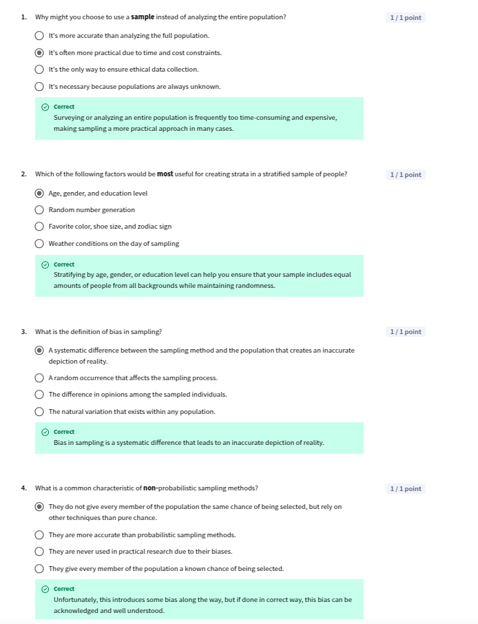
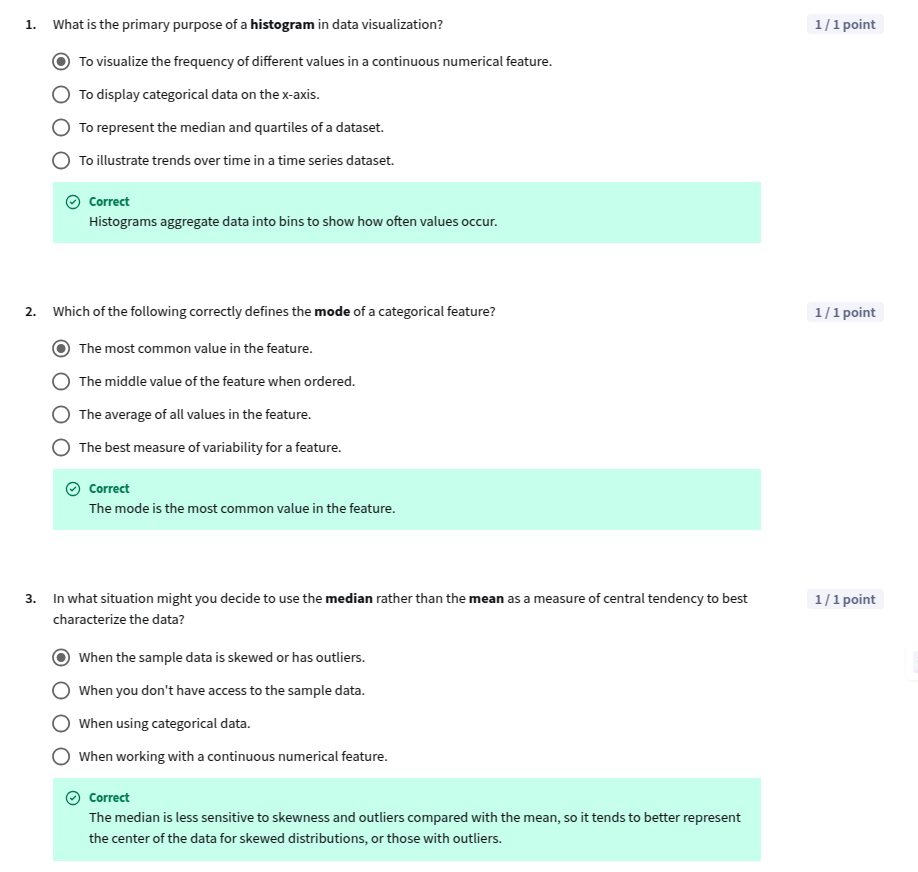

## Module 1: Foundational Statistical Techniques

### Introdcution

🎥 [1 Welcome to this course W1 L1](https://www.youtube.com/watch?v=gAX8lLkQaS4)  
🎥 [2 generative ai in this course W1 L1](https://www.youtube.com/watch?v=i3vGDFtUDdQ)  
🎥 [3 module 1 introduction W1 L1](https://www.youtube.com/watch?v=ieGRasHIPIc)  

----

### Population and Sampling

🎥 [4 populations and sampling W1 L2](https://www.youtube.com/watch?v=uZGsoMZrgN8) 

You always dont have access to the whole population, so you take a sample.  
**Law of Large Number:**  
As the sample size increases, the sample mean gets closer to the population mean.  

🎥 [5 identifying the population W1 L2](https://www.youtube.com/watch?v=DfZC5ldYmWM)  
🎥 [6 probabilistic samples W1 L2](https://www.youtube.com/watch?v=5zmlLBC_KnM)  

Sampling methods:  
- Probabilistic: Gives every member of population a known, non-zero change of being selected.
  - Random: Gives every member of the population an equal chance of being selected.
  - Stratified: Population is divided into subgroups, and a random sample is taken from each subgroup.
  - Cluster: Population is divided into clusters, and a random sample of clusters is selected.
  - Systematic: Every nth member of the population is selected, periodicity bias

🎥 [7 non probabilistic samples W1 L2](https://www.youtube.com/watch?v=5H41e5KoGjo)  

- Non Probabilistic: Dont give every member of the population a known, non-zero chance of being selected.
  - Convenience: Easy to access, but not representative, significant bias
  - Judgement: Based on the judgement of the researcher
  - Snowball: Participants refer other participants
  - Quota: Based on a specific characteristic  
  
🎥 [8 types of bias W1 L2](https://www.youtube.com/watch?v=1XwZyCGKU-E)

Bias when sample does not represent the population.   
Types of bias:
- Sampling bias: when deciding how to sample
  - Selection bias: Sample is not representative of the population
  - Non-response bias: when some members of the population are less likely to respond
- Measurement bias: when data is collected
  - Instrument bias: when the instrument used to collect data is not accurate
  - Observer bias: when the observer influences the data
- Response bias: when data is collected
- Analysis bias: during insights generation
  - Confirmation bias: when the researcher looks for data that confirms their hypothesis

**Lesson 1 Quiz**  
  

----

### Central Tendency

🎥 [9 histograms W1 L3](https://www.youtube.com/watch?v=Z3X9JoUEBM4)  
🎥 [10 demo plotting distributions W1 L3](https://www.youtube.com/watch?v=FsbivapM4uc)  
🎥 [11 central tendency variability and skewness W1 L3](https://www.youtube.com/watch?v=uY_SXmuZEuo)  
🎥 [12 central tendency mean and mode W1 L3](https://www.youtube.com/watch?v=noySUfr9CEE)  

$$ Sample Mean \: \bar{x} = \sum_{i=1}^{n} \frac{x_i}{n} $$


🎥 [13 central tendency median W1 L3](https://www.youtube.com/watch?v=EdlwAVgHZ3k)  

$$ median = \begin{cases} 
      x_{(n+1)/2} & \text{if n is odd} \\
      \frac{x_{n/2} + x_{n/2 + 1}}{2} & \text{if n is even}
   \end{cases} $$

🎥 [14 demo central tendency W1 L3](https://www.youtube.com/watch?v=wVBQXGTaVbg)  

Below are the excel commands
```excel
=average(A2:A11)
=median(A2:A11)
=mode(A2:A11)
=percentile(A2:A11, 0.25)
```

**Lesson 2 Quiz**  
  


**Practice Lab: DJing with data - Part 1**  
[C2M1_PracticeLab_1](https://docs.google.com/spreadsheets/d/182JgclyFEhKt2E4uW-7aUhtvM_rWTUtpMTiXz5WTjhs/edit?usp=sharing)

-----

### Variability and Skewness

🎥 [15 variability range and interquartile range W1 L4](https://www.youtube.com/watch?v=wRv5dsXhtx4)  

$$ Range = x_{max} - x_{min} $$
$$ IQR = Q3 - Q1 $$
$$ Q1 = x_{(n+1)/4} $$
$$ Q3 = x_{3(n+1)/4} $$

🎥 [16 variability variance and standard deviation W1 L4](https://www.youtube.com/watch?v=sUDd1wHrwTM)  

$$ (Variance) \: S^{2} = \frac{\sum_{i=1}^{n} (x_i - \bar{x})^2}{n-1} $$
$$ (Sample \: Standard \: Deviation)  \: S = \sqrt{Variance} $$

🎥 [17 skewness W1 L4](https://www.youtube.com/watch?v=BQx3WX2bJ20)  

$$ Skewness = \frac{\sum_{i=1}^{n} (x_i - \bar{x})^3}{n \times \sigma^3} $$

**Positive Skew**: Mean > Median, Long tail at right  
**Negative Skew**: Mean < Median, long tail at left  

```excel
=skew(A2:A11)
```

🎥 [18 why use these measures W1 L4](https://www.youtube.com/watch?v=6yo3anEPutY)  
🎥 [19 demo variability and skewness W1 L4](https://www.youtube.com/watch?v=wloAxF-HwXM)  
🎥 [20 box plots W1 L4](https://www.youtube.com/watch?v=PuL92Z1rLPw)  
🎥 [21 demo llms for spreadsheet formulas errors W1 L4](https://www.youtube.com/watch?v=53RWPeJ3tww) 

**Lesson 3 Quiz**    
  
  

**Practice Lab: DJing with data - Part 2**  
[C2M1_PracticeLab_2](https://docs.google.com/spreadsheets/d/1Jvvb5QLZ4IsP8401S9Ri5ngJjlTlZ2I2GQu8dJibLks/edit?usp=sharing)


-----

### Correlation

🎥 [22 correlation W1 L5](https://www.youtube.com/watch?v=KuoKIzTW4cU)  

$$ (Pearson \: Correlation) \: r = \frac{\sum_{i=1}^{n} (x_i - \bar{x})(y_i - \bar{y})}{(n-1) \times \sigma_x \times \sigma_y} $$

🚨 Pearson Corrleation measures the linear relationship between two features and does not depend on the slope.  

🎥 [23 correlation and causation W1 L5](https://www.youtube.com/watch?v=hTHmsdmQ6mk)  

Correlation does not imply causation. **Confounding Variable** controls both dependent and independent variable.  


🎥 [24 demo correlations scatterplots in spreadsheets W1 L5](https://www.youtube.com/watch?v=pT6vrU6HS3E) 

```excel
=correl(A2:A11, B2:B11)
```

**Lesson 4 quiz**  
  
  

**Practice Lab: DJing with data - Part 3**  
[C2M1_PracticeLab_4](https://docs.google.com/spreadsheets/d/1kYrP1w_WXnPdd9oVKFpCzi6_esym_NTxNFnwcgjl7nw/edit?usp=sharing)

-----

### Segmentation

🎥 [25 what is segmentation W1 L6](https://www.youtube.com/watch?v=Q19TLBU42Yo) 

Dividing the data into segments to understand the data better.  

🎥 [26 demo xlookup W1 L6](https://www.youtube.com/watch?v=6umL_v4Tdgw)  

```excel
=XLOOKUP("value to find", "range to search", "range to return", "value if not found", "match mode", "search mode")

arrayformula(xlookup("value to find", "range to search", "range to return", "value if not found", "match mode", "search mode"))
```
🎥 [27 demo pivot tables W1 L6](https://www.youtube.com/watch?v=9FbYspjS6l8) 

**Lesson 5 Quiz**  
  
  
------

### Graded Quiz

**Q1**: Your colleague is working with a dataset of product returns. They have shared the following information with you about the return amount feature in the dataset: x̄ = $12.79 s = $3.10 n = 250 How would you interpret this information?  
- [x] The average return amount is $12.79. The standard deviation of the return amount is $3.10. The number of returns is 250.  
- [ ] The average return amount is $3.10. The standard deviation of the return amount if $12.79. The number of returns is 250.  
- [ ] The median return amount is $12.79. The interquartile range of the return amount is $3.10. The number of returns is 250.  
- [ ] The mean and median return amount is $12.79. The standard deviation of the return amount is $3.10. The number of returns is 250.  

**Q2**: Which two of the following options are types of biases that can occur when collecting your sample? (Select all that apply)  
- [ ] Selection bias  
- [x] Nonresponse bias  
- [x] Measurement bias  
- [ ] Analysis bias  

**Q3**: When conducting a segmentation analysis, why is it important to use the same set of analyses across all the different segments?  
- [x] To ensure consistency and comparability of results across segments.  
- [ ] To reduce the amount of data you need to analyze.  
- [ ] To increase the complexity of the analysis.  

**Q4**: You're examining the relationship between a turtle's size and how fast it completes a turtle race. You calculated a negative Pearson Correlation Coefficient (r). What does this value indicate about the relationship between the two features?  
- [x] As one feature increases, the other tends to decrease.  
- [ ] As one feature increases, the other also increases.  
- [ ] There is no relationship between the features.  
- [ ] There is a nonlinear relationship between the two features.  

**Q5**: Which four of the following options are non-probabilistic sampling methods? (Select all that apply)  
- [x] Convenience sampling  
- [x] Quota sampling  
- [x] Judgmental sampling  
- [x] Snowball sampling  
- [ ] Simple random sampling  

**Q6**: According to the lectures, which step must come first when defining the population of interest for your analysis?  
- [x] Use your hypothesis or research question to better understand the problem.  
- [ ] Consider the practical constraints like accessibility, budget, and time available.  
- [ ] Collect your sample, such as by interviewing participants or locating relevant data.  
- [ ] Determine the generalizability of your sample.  

**Q7**: Which of the following questions about your data can you answer using measures of variability?  
- [x] Are the values in the data clustered together or spread out?  
- [ ] What values are most frequent?  
- [ ] Where is the middle of the data?  
- [ ] Is the distribution symmetrical or does it lean to one side?  

**Q8**: You calculated a Pearson Correlation Coefficient (r) of 0 between two features: the age of a turtle's handler and the turtle's racing speed. What does this value indicate?  
- [x] There is no linear relationship between the features.  
- [ ] There is a perfect positive correlation.  
- [ ] There is a perfect negative correlation.  
- [ ] There is no relationship of any kind – linear or nonlinear – between the features.  

**Q9**: Recall that systematic sampling means starting with a random member of the population, then selecting every nth member after that (such as every 10th member). What is a potential issue with systematic sampling?  
- [x] Periodicity bias, since patterns in the data can cause a systematic deviation from the population.  
- [ ] Expense, since you must survey more people compared with a simple random sample.  
- [ ] Randomness, since the initial member is selected randomly.  
- [ ] Difficulty, since it can be complex to randomly generate the nth member.  

**Q10**: You're examining a dataset of turtle racing times. You plotted the histogram below showing the frequencies of different ranges of times. Which two of the following statements reflect true conclusions about the turtle racing times?  
- [x] The race times are positively skewed.  
- [ ] The race times are negatively skewed.  
- [x] The mean is greater than the median.  
- [ ] The median is greater than the mean.  


-----

### Graded Lab

[C2M1_GradedLab](https://docs.google.com/spreadsheets/d/1VhCgc2fjJv69BeARiJ7LPlEnmofb8ngz5R-l6HmrDYI/edit?usp=sharing)

```excel
INDEX(RANGE, MATCH(MAX(RANGE), RANGE, 0))
```

**Q1**: Which of the following features has the **smallest** difference between mean and median?  
- [x] temp  
- [ ] area  
- [ ] ISI  

**Q2**: Which X value has the greatest number of forest fires?  
- **Answer**: 4  

**Q3**: Examine the distributions you plotted in Exercise 1. Which **three** of the following statements are **true** about these distributions?  
- [x] The distribution of temperature is mostly symmetrical.  
- [ ] All possible values for the feature Y are represented in the dataset.  
- [x] Most of the values for ISI are below 25.  
- [x] The **area** feature is strongly positively skewed.  

**Q4**: Which X coordinate on average has fires with the **smallest** area?  
- **Answer**: 3  

**Q5**: Which is the mode of feature Y?  
- **Answer**: 4  

**Q6**: What can you conclude about the difference between **mean** and **median** for the variable DC?  
- [ ] The distribution for **all** segments has negative skewness.  
- [ ] Segment 9 has **negative** skewness.  
- [x] Segment 9 has **positive** skewness.  
- [ ] Segment 2 has **positive** skewness.  

**Q7**: You have been tasked with analyzing forest fires in Montesinho national park in order to help the park plan its resources and better prevent fires. Which of the following is a possible **bias** introduced by using this particular dataset for your analysis?  
- [ ] The dataset has no bias because it is a simple random sample.  
- [x] The dataset only contains fires from 2000 to 2003, and fires during that period may systematically differ from present day fires.  
- [ ] This dataset only considers forest fires and not other types of natural disasters, such as landslides.  
- [ ] This dataset did not record the name of the person measuring the fire.  

**Q8**: Which **two** of the following statements are **true** about the relationships between the features in your data?  
- [x] The correlation between **RH** and temperature is **stronger** compared with the correlation between **ISI** and temperature.  
- [ ] The correlation between **ISI** and temperature is **stronger** compared with the correlation between **RH** and temperature.  
- [x] Both pairs of features have a moderate correlation with an absolute value between 0.3 and 0.7.  
- [ ] Neither scatter plot contains any outliers.  

**Q9**: Which feature has the **smallest** skewness?  
- [x] temp  
- [ ] ISI  
- [ ] Y  
- [ ] area  

**Q10**: Which X coordinate has the greatest **variability** in forest fire area?  
- [x] Segment 9  
- [ ] Segment 2  
- [ ] Segment 5  
- [ ] Segment 3  


------
------
