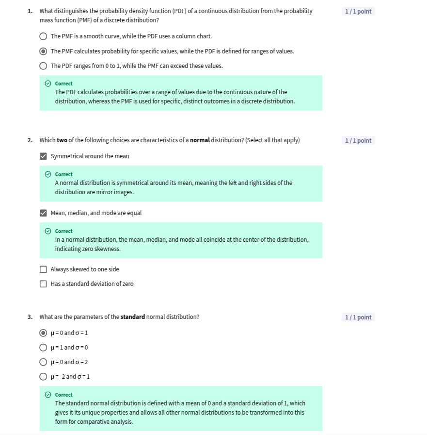

## Module 2: Probability and Simulation

[Slides](C2_M2.pdf)

### Introduction

🎥 [28 module 2 introduction W2 L1](https://www.youtube.com/watch?v=KgF2TIKW-BM)  

----

### Fundamental of probability

🎥 [29 randomness and uncertainty W2 L2](https://www.youtube.com/watch?v=u_k5aqzAFbI)  
🎥 [30 probability and the addition rule W2 L2](https://www.youtube.com/watch?v=UL91E2Q3_-4) 

**Experiment:** An action or process that leads to one or more outcomes (e.g., flipping a coin).

**Event:** A specific set of outcomes (e.g., getting heads).

**Outcome:** A possible result of an experiment (e.g., heads or tails).  

**Sample Space:** the set of all possible outcomes of an experiment.  

🎥 [31 the multiplication and complement rules W2 L2](https://www.youtube.com/watch?v=zZoMPUa1vtY)  

For **mutually exclusive events**, the probability of either event occurring is the sum of the probabilities of the individual events.    
For **independent events**, the probability of both events occurring is the product of the probabilities of the individual events.  
**Complement Rule:** The probability of an event not occurring is 1 minus the probability of the event occurring.

🎥 [32 conditional probability W2 L2](https://www.youtube.com/watch?v=KB65vhOMuHQ) 

**Conditional Probability:** The probability of an event given that another event has occurred.

$$P(A|B) = \frac{P(A \cap B)}{P(B)}$$

**Multiplication Rule for Conditional Probability:** The probability of the intersection of two events is the product of the probability of one of the events and the conditional probability of the other event given the first event.

$$P(A \cap B) = P(A) \cdot P(B|A)$$

🎥 [33 independence W2 L2](https://www.youtube.com/watch?v=xI58Uuu0ABA)  

**Independence:** Two events are independent if the occurrence of one event does not affect the probability of the occurrence of the other event.

$$P(A \cap B) = P(A) \cdot P(B)$$


🎥 [34 random variables W2 L2](https://www.youtube.com/watch?v=xQVTYyRug40) 

**Random Variable:** A variable that can take on different values based on the outcome of a random event.  
**Discrete Random Variable:** A random variable that can take on a countable number of values.  
**Continuous Random Variable:** A random variable that can take on an infinite number of values.  

**Lesson 1 Quiz**  
  
  


**Practice Lab: DJing with data follow up - Part 1**  
[C2M2_PracticeLab_1](https://docs.google.com/spreadsheets/d/1b0iFEHXQ82ZN06nxfbNBhYALXrYfoM0P7JxnaiYnEHA/edit?usp=sharing)

-----

### Discrete probability distributions

🎥 [35 estimation W2 L3](https://www.youtube.com/watch?v=aag9-be35iM)  

$$ Sample \rightarrow Statistic $$  
$$ Population \rightarrow Parameter $$

🎥 [36 from sample distributions to population distribution W2 L3](https://www.youtube.com/watch?v=EDfQsoHkqwM)  

**Probability Mass Function;** The probability mass function (pmf) is a function that gives the probability that a discrete random variable is exactly equal to some value.  

**Probability Dnesity Function:** The probability density function (pdf) is a function that describes the likelihood of a continuous random variable taking on a particular value.

🎥 [37 the bernoulli distribution W2 L3](https://www.youtube.com/watch?v=lMP1G7BLynM)  

A distribution modeling a random variable with only two possible outcomes: success (1) with probability p, and failure (0) with probability 1 - p.

$$ \text{Bernoulli Distribution: Only have 2 possible outcomes}$$
$$ X \sim Bernoulli(p) $$
$$ P(X = 1) = p $$
$$ P(X = 0) = 1 - p $$
$$ E(X) = p $$
$$ Var(X) = p(1-p) $$
$$ SD(X) = \sqrt{p(1-p)} $$


🎥 [38 the binomial distribution W2 L3](https://www.youtube.com/watch?v=aYKmM7h9tUE) 

A distribution that models the probability of a specific number of successes in a fixed number of independent trials, each with the same probability of success ( p ).

$$ \text{Binomial Distribution: Multiple Bernoulli trials}$$
$$ X \sim Bin(n, p) $$
$$ P(X = k) = \binom{n}{k} p^k (1-p)^{n-k} $$
$$ E(X) = np $$
$$ Var(X) = np(1-p) $$
$$ SD(X) = \sqrt{np(1-p)} $$
$$ \text{where } \binom{n}{k} = \frac{n!}{k!(n-k)!} $$
$$ \text{where } n! = n \cdot (n-1) \cdot (n-2) \cdot \ldots \cdot 2 \cdot 1 $$

To compute the probability of getting exactly k successes in n trials with probability p of success in each trial in Excel:
```excel
=BINOM.DIST(k,n,p,False)
```

🎥 [39 the cumulative distribution function W2 L3](https://www.youtube.com/watch?v=xT6N1TCp288) 

**Cumulative Distribution Function:** The cumulative distribution function (CDF) is a function that gives the probability that a random variable is less than or equal to a certain value.

$$ P(X \leq x) = F(x) $$

To compute the probability of getting at most k successes in n trials with probability p of success in each trial in Excel:
```excel
=BINOM.DIST(k,n,p,True)
```


🎥 [40 random sampling discrete W2 L3](https://www.youtube.com/watch?v=zgkaNrCqfcE) 

The process of selecting a sample from a population in such a way that every possible sample has an equal chance of being chosen. This can be done using random number generators or functions like RAND() in spreadsheets.


$$ \text{Standard Uniform Distribution: U(0,1)} $$
$$ X \sim Uniform(0,1) $$
$$ f(x) = 1 \text{ for } 0 \leq x \leq 1 $$
$$ f(x) = 0 \text{ otherwise} $$
$$ F(x) = x \text{ for } 0 \leq x \leq 1 $$

 
🎥 [41 demo spreadsheet simulation discrete W2 L3](https://www.youtube.com/watch?v=dmu0H3JeJU8) 

Generate sample from the standard uniform distribution in Excel:
```excel
=RAND()

=RANDARRAY(100)

=ARRAYFORMULA()
```

🎥 [42 demo llm simulation discrete W2 L3](https://www.youtube.com/watch?v=OgBT48gMSL8) 


**Lesson 2 Quiz**  
  
  

**Practice Lab: DJing with data follow up - Part 2**  
[C2M2_PracticeLab_2](https://docs.google.com/spreadsheets/d/1RU8wuyV7DTLrOcHk-Q6fG_IwzxC7ch-omT5Fu7k3n-s/edit?usp=sharing)
-----

### Simulation

Simulation is the process of generating new data samples based on existing knowledge or assumptions about how data behaves. It creates a virtual world where real-world behaviors can be modeled, offering invaluable insights without the risks or limitations of real-world testing.

🎥 [43 continuous probability distributions W2 L4](https://www.youtube.com/watch?v=ojyEotyLHjA)  

Continuous probability distributions are used to model random variables that can take on an infinite number of values. It have a probability density function (pdf) that describes the likelihood of a continuous random variable taking on a particular value.

**Power Law Distribution** probability inversely proportional to size.

🎥 [44 the normal distribution W2 L4](https://www.youtube.com/watch?v=fk6_zbjsyT0) 

For normal distribution, the mean, median, and mode are equal. The normal distribution is symmetric about the mean. 

**Sigma Rule**  
- 68% of the data falls within 1 standard deviation of the mean.
- 95% of the data falls within 2 standard deviations of the mean.
- 99.7% of the data falls within 3 standard deviations of the mean.

🎥 [45 the standard normal distribution W2 L4](https://www.youtube.com/watch?v=xIEJSnpEyX0)  

The standard normal distribution has a mean of 0 and a standard deviation of 1.

$$ Z \sim N(0,1) $$  

**Z-Score** are similar to percentile ranks, but they are based on standard deviations. Z-scores are used to measure how many standard deviations a value is from the mean of a distribution. They provide a way to standardize scores on different scales, making it easier to compare data points from different distributions.  

A z-score indicates how far and in what direction a value deviates from the mean of the data set. A positive z-score means the data point is above the mean, while a negative z-score indicates it is below the mean.  
$$ Z = \frac{X - \mu}{\sigma} $$   
$$ X = \mu + Z \cdot \sigma $$  
$$ P(X \leq x) = P(Z \leq \frac{x - \mu}{\sigma}) $$  
$$ P(X \geq x) = 1 - P(X \leq x) $$   
$$ P(X > x) = 1 - P(X \leq x) $$  


- **90%** of the data: within **1.645** standard deviations 
- **95%** of the data: within **1.96** standard deviations 
- **99%** of the data: within **2.576** standard deviations

```excel
=NORM.DIST(x,mean,stddev,TRUE)
=NORM.INV(probability,mean,stddev)
=NORM.S.INV(probability)
```

🎥 [46 random sampling normal W2 L4](https://www.youtube.com/watch?v=kspqiwyy7UM)  

`NORM.INV` function in Excel can be used to generate random samples from a normal distribution. identify corresponding x for a given CDF value and parameters.

```excel
=NORM.INV(RAND(),mean,stddev)
```

🎥 [47 demo spreadsheet simulation normal W2 L4](https://www.youtube.com/watch?v=bjBPe8WkFYE)  
🎥 [48 demo llm simulation normal W2 L4](https://www.youtube.com/watch?v=v3AVBo6m5_U)  
🎥 [49 making decisions with distributions W2 L4](https://www.youtube.com/watch?v=b2eLerI-JlU) 


- The **geometric distribution** is related to the binomial distribution. Instead of counting the number of successes in a fixed number of trials, it counts the number of trials needed to achieve the first success.

- The **negative binomial distribution** is a more general case of the geometric distribution. While the geometric distribution counts the number of trials needed to achieve the first success, the negative binomial distribution counts the number of trials needed to achieve a specified number of successes (r).

- The **Poisson distribution** is a discrete distribution that models the number of events occurring within a fixed interval of time. It is parameterized by 𝜆, which represents the average number of events in the interval. This distribution is particularly useful for modeling rare events over a continuous period.

The Poisson distribution is related to the binomial distribution but differs in that it models the number of events in a fixed interval rather than the number of successes in a fixed number of trials.

- The **exponential distribution** is a continuous probability distribution that models the time between events. It closely relates to the poisson distribution, as the events are of exactly the same type, but instead of fixing the time and counting the events, now you want to understand how much time would pass between the events. It is characterized by a rate parameter ( \lambda ), which represents the average number of events per unit time. One key property of the exponential distribution is its memorylessness, meaning the probability of an event occurring in the future is independent of when the last event occurred in the past.

The exponential distribution is the continuous counterpart to the geometric distribution. While the geometric distribution counts the number of trials until the first success, the exponential distribution measures the time until the first event occurs.

- The **gamma distribution** extends the exponential distribution by modeling the total time until an event occurs a specified number of times. It is parameterized by a shape parameter k (representing the number of events) and a rate parameter 𝜆 (representing the rate of occurrence of the events). While the exponential distribution models the time between individual events, the gamma distribution models the cumulative time until multiple events occur.

The gamma distribution is the continuous counterpart to the negative binomial distribution. While the negative binomial distribution counts the number of trials needed to achieve a specified number of successes, the gamma distribution measures the total time until a specified number of events occur.

The exponential distribution equals the gamma distribution with the parameter k = 1, just like the geometric distribution equals the negative binomial distribution with k = 1. 

**Lesson 3 Quiz**  
  
  

**Practice Lab: DJing with data follow up - Part 3**    
[C2M2_PracticeLab_3](https://docs.google.com/spreadsheets/d/1Mf4sa0CMfiQ4cHzoJAJcBp77hilXtwLZ1jJmQFKFQSk/edit?usp=sharing)
-----

### Graded Quiz

**Q1**: What is a random variable?  
- [ ] A variable that can only take on one value.  
- [x] A variable that represents all the possible outcomes of a random phenomenon.  
- [ ] A variable that represents numerical outcomes.  
- [ ] A variable that represents the probabilities of various events.  

**Q2**: Which three of the following options are sources of real-world randomness? (Select all that apply)  
- [x] Hidden features that influence the outcome.  
- [x] Complex interactions between features.  
- [ ] Perfect predictability of all events.  
- [x] Measurement limitations.  

**Q3**: Your company is evaluating whether customers who receive a free trial are more likely to sign up for your music subscription service. Historical data suggests that users who receive a free trial sign up for your service at a rate of 60%. How can you use random sampling with the standard uniform distribution to simulate a user who signs up for the service?  
- [ ] Generate a random sample between 0 and 1; if the number is less than or equal to 0.4, simulate a user who signed up for the service.  
- [x] Generate a random sample between 0 and 1; if the number is less than or equal to 0.6, simulate a user who signed up for the service.  
- [ ] Generate a random sample between 0 and 1; if the number is greater than 0.6, simulate a user who signed up for the service.  
- [ ] Generate a random sample between 0 and 1; if the number is greater than 0.8, simulate a user who signed up for the service.  

**Q4**: Your company is helping a car dealership analyze their sales process. The dealership has found that 30% of customers who test drive a car end up purchasing it. What is the probability of a customer not purchasing the car after a test?  
- [ ] 25%  
- [ ] 30%  
- [ ] 50%  
- [x] 70%  

**Q5**: What does a distribution tell you about your sample data or population of interest?  
- [ ] The exact values of all data points.  
- [x] How often different values occur.  
- [ ] The causes of the variations in your data.  
- [ ] The median value of the dataset.  

**Q6**: Your company is running an email marketing campaign and sends a promotional offer to 100 customers. Each customer either makes a purchase or doesn’t. You want to model the total number of purchases that will result from this campaign. Assuming that each customer has a fixed probability of buying, which probability distribution best models this scenario?  
- [ ] Normal distribution  
- [ ] Bernoulli distribution  
- [ ] Power law distribution  
- [x] Binomial distribution  

**Q7**: Which three of the following options are key characteristics of the normal distribution? (Select all that apply)  
- [x] It is symmetrical around the mean.  
- [x] The mean, median, and mode are all equal.  
- [ ] It has a skewed distribution.  
- [ ] It has multiple peaks.  
- [x] The tails extend to positive and negative infinity.  

**Q8**: What is the multiplication rule for independent events?  
- [ ] P(A and B) = P(A) + P(B)  
- [ ] P(B) = 1 - P(A)  
- [x] P(A and B) = P(A) * P(B)  
- [ ] P(A and B) = P(A|B) * P(B|A)  

**Q9**: Which of the following options correctly describes the meaning of a z-score?  
- [x] A z-score describes the number of standard deviations a particular value is from the mean in the standard normal distribution.  
- [ ] A z-score describes the number of different possible normal distributions that can be defined using a particular outcome.  
- [ ] A z-score describes the mean value of the standard normal distribution.  
- [ ] A z-score is equivalent to the percentile of a particular value.  

**Q10**: Based on the set of sigma rules associated with the normal distribution, 99.7% of the data falls within how many standard deviations of the mean?  
- [x] 3  
- [ ] 1  
- [ ] 2  
- [ ] 4  

**Q11**: Below is a graph of the cumulative distribution function (CDF) for a binomial distribution with n = 10 and p = 0.7. How should you interpret the bar for 6 successes?  
- [x] The probability of obtaining 6 successes or fewer is around 35%.  
- [ ] The probability of obtaining more than 6 successes is around 35%.  
- [ ] The probability of obtaining exactly 6 successes is around 35%.  
- [ ] The probability of obtaining 5, 6, or 7 successes is around 35%.  

**Q12**: What is the process for estimating a particular value of a population using a sample?  
- [x] You collect a sample, then use the sample statistic (such as x̄) to estimate the population parameter (such as μ).  
- [ ] You collect data from the entire population, then use the population parameter (such as μ) to estimate a sample statistic (such as x̄).  
- [ ] You collect a sample, then use the sample statistic (such as x̄) to estimate another sample statistic (such as x̄).  
- [ ] You collect data from the entire population, then use the population parameter (such as μ) to estimate another population parameter (such as μ).


-----

### Graded Lab

[C2M2_GradedLab](https://docs.google.com/spreadsheets/d/1dBWhEsiGqismG44ZjC3yruItIS6eF41ADOcBVC8Kl1A/edit?usp=sharing)


**Q1**: What is the frequency of fires with area < 0.5 and on X = 2?  
- **Answer**: 0.0618  

**Q2**: Are the events “The fire has small area” and “The fire happened on X coordinate 2” independent?  
- [ ] Yes  
- [x] No  

**Q3**: According to your dataset, which event is most frequent (most likely to occur)?  
- [x] Having a small fire occur on any coordinate  
- [ ] Having a fire of any size occur on X coordinate 2.  
- [ ] Having a small fire occur on X coordinate 2.  
- [ ] Having a small fire given that the X coordinate is 2.  

**Q4**: Based on the distribution charts you created in Exercise 2, which of the following features appear as though they might follow a normal distribution?  
- [x] temp  
- [ ] DC  
- [ ] is_small  

**Q5**: Why might you conclude that the DC feature does not follow a normal distribution?  
- [x] It does not appear to be symmetric about the mean.  
- [ ] It does not appear to have a fixed number of trials.  
- [ ] It does not appear to have only two outcomes: success and failure.  
- [ ] It does not have a mean of 1.  

**Q6**: What can you say about the ISI feature?  
- [ ] It appears to be uniformly distributed  
- [x] It appears to have an outlier at 56.1  
- [x] The data only has positive values  
- [ ] It is a discrete variable  

**Q7**: What is the mean temperature (temp) in the data?  
- **Answer**: 18.89  

**Q8**: Do the observed frequencies of temp falling within 1, 2, and 3 standard deviations ($s$) from the mean closely match (within a margin of 0.05) the theoretical predictions provided by the set of sigma rules for the normal distribution?  
- [x] Yes  
- [ ] No  

**Q9**: Which two of the following are correct statements about using a normal distribution to simulate the temperature based on this dataset (select all that apply)?  
- [x] Because the distribution of the temp feature resembles a normal distribution, it is reasonable to use the normal distribution for simulation.  
- [x] When simulating the temperature, you can use the sample mean and standard deviation as estimates for the true population parameters.  
- [ ] You will only be able to perform a simulation once using this data.  
- [ ] Your simulation will always generate the same values as you have observed in the data.  

**Q10**: The parks department chief has asked you to simulate the number of small fires in a group of 10 fires. Recall that the proportion of fires that are small is 0.4971. Which distribution would best model this scenario?  
- [ ] A normal distribution with μ=10 and σ=0.4971  
- [ ] A uniform distribution with range -10 to 10  
- [x] A Binomial distribution with n=10 and p=0.4971  
- [ ] A Bernoulli distribution with p=0.4971  


-----