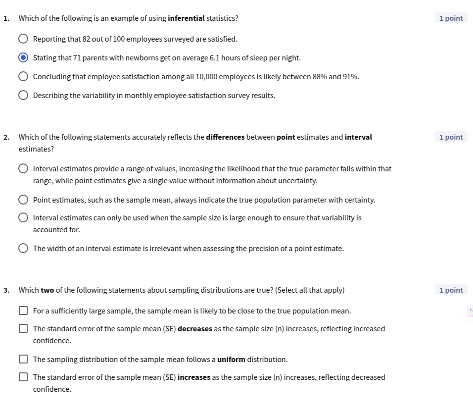
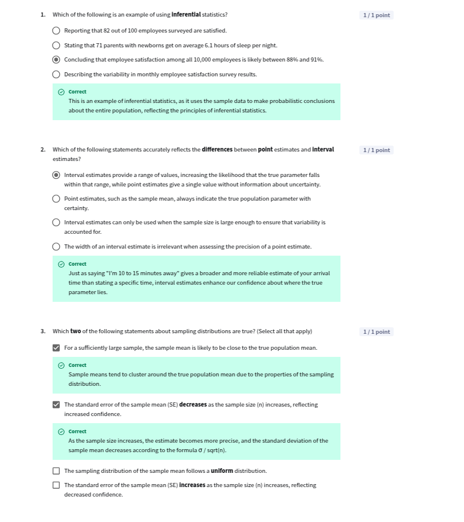
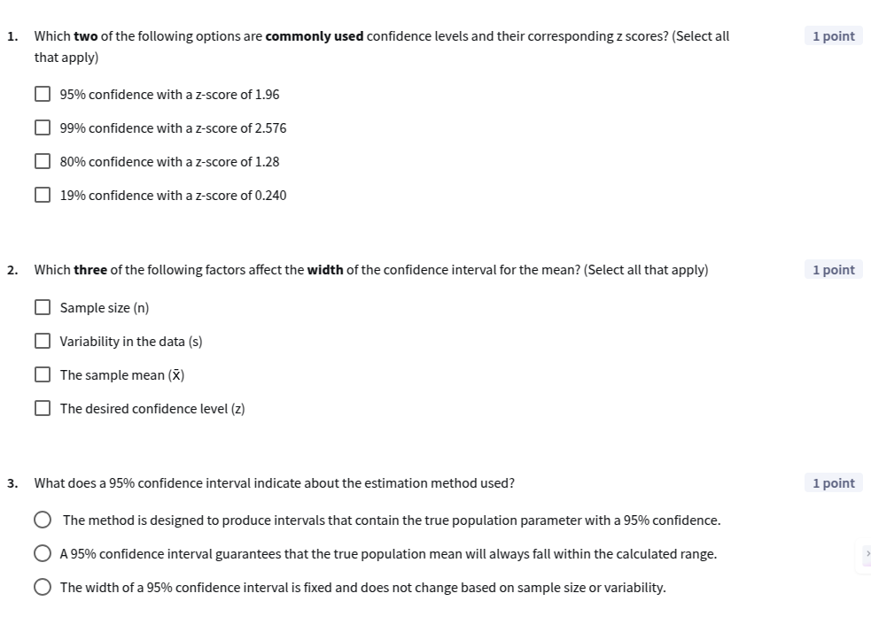
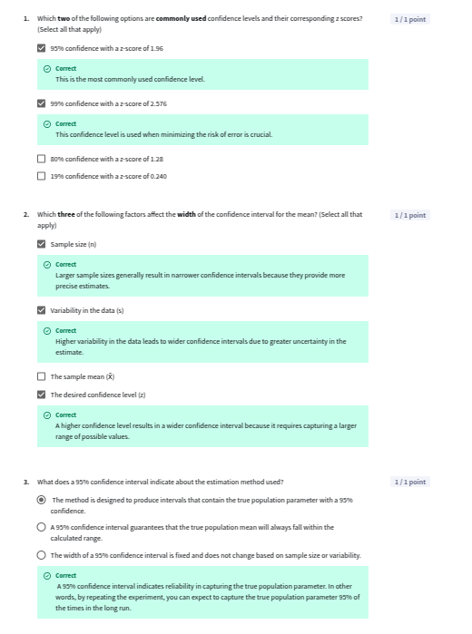
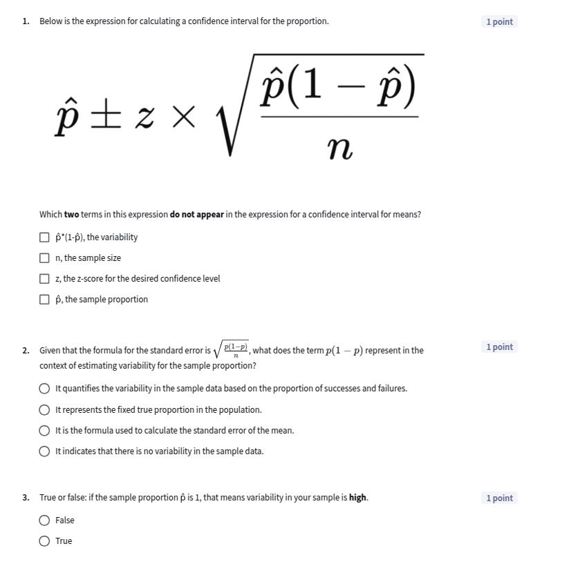
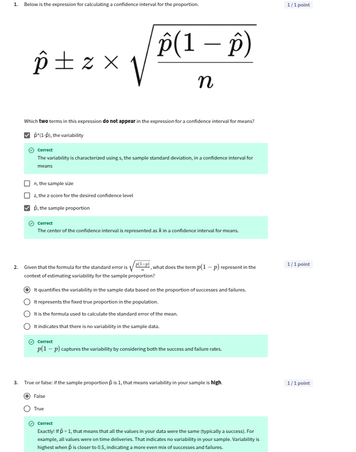

## Module 3: Confidence Intervals

[Slides](./C2_M3.pdf)

-----
### Introduction

🎥 [50 module 3 introduction W3 L1](https://www.youtube.com/watch?v=chPL-A7O-pM)  

-----

### Inferential Statistics

🎥 [51 inferential statistics W3 L2](https://www.youtube.com/watch?v=bi6Zh6Dr8EM)  

Descriptive statistics tell us about the behaviour of our data. **Inferential statistics** tell us about the behaviour of the population from which the data was drawn. Inferential statistics are used to **make inferences about the population based on the sample data**.

| Descriptive Statistics | Inferential Statistics |
| -------- | -------- | 
| State facts about sample | Use Sample data to draw conclusions about population|

🎥 [52 point interval estimates W3 L2](https://www.youtube.com/watch?v=0sqfjrq8fkA) 

**Point estimates** are single values that are used to estimate population parameters. For example, the sample mean is a point estimate of the population mean. But they do not contain any information about the uncertainty of the estimate.   
**Interval estimates** provide a range of values that are likely to contain the population parameter. A lower interval gives us more confidence that the population parameter is within the interval.

🎥 [53 sampling distributions the central limit theorem W3 L2](https://www.youtube.com/watch?v=H5-SYFcEG3M) 

**Central Limit Theorem** (CLT) states that the sampling distribution of the sample mean will be approximately normally distributed, regardless of the shape of the population distribution, as long as the sample size is sufficiently large (n > 30) and samples are independent and identically distributed (i.i.d.). The CLT is important because it allows us to make inferences about the population mean based on the sample mean.

The CLT applies under certain conditions:
- Sample Size: The sample size should be sufficiently large. A common rule of thumb is that a sample size of 30 or more is usually adequate. In general, if the data is close to normally distributed, you would need less samples, but if it is very skewed, you might need more than that.
- Independence: The samples must be independent of each other.
- Identically Distributed: The samples should be drawn from the same population and follow the same probability distribution.

The **sampling distribution** is the distribution of a sample statistic (such as the sample mean) across all possible samples of a given size. The sampling distribution is important because it allows us to make inferences about the population parameter based on the sample statistic.

The **standard error** is a measure of the variability of the sample statistic. It is calculated as the standard deviation of the sample statistic divided by the square root of the sample size. The standard error is important because it tells us how much the sample statistic is likely to vary from the population parameter.

$$ SE = \frac{\sigma}{\sqrt{n}} $$

where $\sigma$ is the population standard deviation and n is the sample size.

**Lesson 1 Quiz**  
  
  
------

### Confidence Intervals for means

🎥 [54 demo confidence intervals in action W3 L3](https://www.youtube.com/watch?v=RqPll8-0-Do)  
🎥 [55 confidence intervals W3 L3](https://www.youtube.com/watch?v=q4WBH54EJx4) 

**Confidence intervals** are used to estimate the range of values that are likely to contain the population parameter. A confidence interval consists of a point estimate (such as the sample mean) and a margin of error. The margin of error is calculated based on the standard error of the sample statistic and the desired level of confidence.

A **confidence level** is the probability that the confidence interval will contain the population parameter. Common confidence levels are 90%, 95%, and 99%. The confidence level is determined by the z-score or t-score associated with the desired level of confidence.

The **margin of error** is the range of values that is added to and subtracted from the point estimate to create the confidence interval. The margin of error is calculated based on the standard error of the sample statistic and the z-score or t-score associated with the desired level of confidence.

$$ Margin \: of \:  Error = Z \times \frac{s}{\sqrt{n}} $$

where Z is the z-score or t-score associated with the desired level of confidence, s is the sample standard deviation, and n is the sample size.

The formula for a confidence interval for the population mean is:

$$ CI = \bar{x} \pm Z \times \frac{s}{\sqrt{n}} $$

where $\bar{x}$ is the sample mean, Z is the z-score or t-score associated with the desired level of confidence, s is the sample standard deviation, and n is the sample size.

**Broad Range = High Uncertainty**  
**Narrow Range = More Precise**

🎥 [56 mechanisms of confidence intervals W3 L3](https://www.youtube.com/watch?v=BB2R7JHs9mY)  

95 % Chance that the confidence interval contains the population mean. This is not the same as saying that there is a 95% chance that the population mean is within the interval. The population mean is a fixed value, and the confidence interval is a range of values that is likely to contain the population mean. 

| Confidence Interval | z-score |
| -------- | -------- |
| 90% | 1.645 |
| 95%% | 1.96 |
| 99% | 2.576 |

**Wider Confidence Interval = Higher Confidence Level**  

We take high confidence intervals when we want to be more certain about the estimate. But this comes at the cost of a wider confidence interval, which means that the estimate is less precise.

🎥 [57 understanding margin of error W3 L3](https://www.youtube.com/watch?v=1Wm4zttIpaA) 

A **narrower confidence interval** is more desirable because it means we have a more **precise estimate**.

Margin of Error depends on:
- Sample Size: Larger sample sizes result in smaller margins of error, it has diminishing returns as the sample size increases.
- Standard Deviation: Smaller standard deviations result in smaller margins of error, it varies linearly with the standard deviation.
- Confidence Level: Higher confidence levels result in larger margins of error, width does not vary linearly with confidence level since we have normal distribution where as we move towrds the tails we have less probability.

🎥 [58 demo confidence intervals for means W3 L3](https://www.youtube.com/watch?v=oNlfaLM468k) 

**Lesson 2 Quiz**  
  

**Practice Lab: Human sleep patterns and stress - Part 1**
[C2M3_PracticeLab_1](https://docs.google.com/spreadsheets/d/129hKUhdfYqY0kl_B4VRsyDypB4gcQPH0C4m7s6vE7Go/edit?usp=sharing)

-----

### Confidence Intervals for proportions

🎥 [59 confidence intervals for proportions W3 L4](https://www.youtube.com/watch?v=K4cKo7VN9wE)  

Proportion $\hat{p}$ is the fraction of the sample that has a certain characteristic. This also follows a normal distribution. The standard error for the proportion is given by:

$$ SE = \sqrt{\frac{\hat{p}(1-\hat{p})}{n}} $$

The formula for a confidence interval for the population proportion is:

$$ CI = \hat{p} \pm Z \times \sqrt{\frac{\hat{p}(1-\hat{p})}{n}} $$

where $\hat{p}$ is the sample proportion and n is the sample size.

🚨 When we take z as 95% confidence level, the z-score is 1.96,it means the proportion of confidence intervals that would contain the true mean if you took many samples and constructed many confidence intervals.

🎥 [60 demo confidence intervals for proportions W3 L4](https://www.youtube.com/watch?v=zohzdG_2rh4)  

**Lesson 3 Quiz**  
  

**Practice Lab: Human sleep patterns and stress - Part 2**  
[C2M3_PracticeLab_2](https://docs.google.com/spreadsheets/d/1uO2NOg3om6iQWrptrGHJ3hWCcPGJrT4A9_oXL4M2rmc/edit?usp=sharing)

-----

### LLMs for Confidence Intervals

🎥 [61 interpretation with llms W3 L5](https://www.youtube.com/watch?v=xvKTWGOpgXs)  
🎥 [62 simulating random sampling with llms W3 L5](https://www.youtube.com/watch?v=VZQO-wZ6hTU)  
🎥 [63 inference and visualization with llms W3 L5](https://www.youtube.com/watch?v=pLDn0Em9dfI) 

-----

### Graded Quiz

**Q1**: Which three of the following statements about inferential statistics are true? (select all that apply)  
- [x] They allow you to make conclusions about a population based on a sample.  
- [x] They quantify your level of confidence in your estimate.  
- [ ] They describe the characteristics of a sample.  
- [x] They account for sample variability.  

**Q2**: Why are interval estimates generally more informative than point estimates?  
- [x] They contain information about the confidence of the estimate.  
- [ ] They provide the exact value of the population parameter.  
- [ ] They are always narrower than point estimates.  
- [ ] They eliminate the need for point estimates.  

**Q3**: What does the Central Limit Theorem state about sample means when you take sufficiently large samples from any distribution?  
- [x] They will be normally distributed.  
- [ ] They will be uniformly distributed.  
- [ ] They will be exponentially distributed.  
- [ ] They will be distributed according to their original sampling distribution.  

**Q4**: What does the "95%" part of a 95% confidence interval for the mean represent?  
- [x] The proportion of confidence intervals that would contain the true mean if you took many samples and constructed many confidence intervals.  
- [ ] The probability that the sample mean is the true mean.  
- [ ] The percentage of the population that falls within the confidence interval.  
- [ ] The amount of variability in the sample that can be quantified using the estimate provided by the confidence interval for the mean.  

**Q5**: What effect does increasing the desired confidence level have on the width of the confidence interval?  
- [x] It makes the confidence interval wider.  
- [ ] It makes the confidence interval narrower.  
- [ ] It has no effect on the width of the confidence interval.  
- [ ] The effect depends on the variability of the sample.  

**Q6**: Which two of the following statements about confidence intervals and z-scores are correct? Select all that apply.  
- [x] A higher confidence level uses a higher z score.  
- [ ] A wider confidence interval means a more precise estimate of the population parameter.  
- [x] The z score represents the number of standard deviations from the mean in a standard normal distribution.  
- [ ] A 90% confidence interval uses a z score of 1.96.  

**Q7**: Which three factors impact the margin of error when constructing a confidence interval for the mean? (Select all that apply)  
- [x] Desired confidence level  
- [x] Standard deviation  
- [x] Sample size  
- [ ] Sample mean  

**Q8**: How does increasing the sample size affect the margin of error?  
- [x] It decreases the margin of error  
- [ ] It increases the margin of error  
- [ ] It has no effect on the margin of error  
- [ ] It makes the margin of error proportional to the mean  

**Q9**: What does p̂ (read as "p hat") represent?  
- [x] The sample proportion  
- [ ] The true proportion  
- [ ] The sample size  
- [ ] The standard deviation  

**Q10**: Which two of the following statements about the standard error for a proportion are true? (Select all that apply)  
- [x] It is calculated using p̂ when the true proportion p is unknown.  
- [x] It decreases as the sample size increases.  
- [ ] It is calculated using the standard deviation.  
- [ ] It is a fixed value derived from the normal distribution.  

-----

### Graded Lab

[C2M3_GradedLab](https://docs.google.com/spreadsheets/d/1kOhHhExLlYwVVArolp8o3HaBEfULMMGQ4y5vSDgq7lQ/edit?usp=sharing)

**Q1**: What is the margin of error for the 95% confidence interval of the price mean? Round the solution to the first two decimal places (e.g. 221.43).  
- **Answer**: 110.3

**Q2**: Based on the confidence interval for the total sample of diamonds, what can you conclude about the average diamond price in the market?  
- [x] You can be 95% confident that the true average diamond price in the market is between the lower and upper bound values.  
- [ ] The average diamond price for all retailers is exactly the x̄ value.  
- [ ] 95% of all diamonds in the market cost between the lower and upper bound values.  
- [ ] The margin of error suggests that the true mean diamond price could be any value above the upper bound value.  

**Q3**: Your stakeholder, the jeweler, saw the results and asked if you can be more than 95% confident in the estimates. Which two statements below would be true if you were to create a 99% confidence interval?  
- [x] The center of both intervals would be the same.  
- [x] The 99% confidence interval would be wider than the 95% confidence interval.  
- [ ] You would need more samples to achieve a 99% confidence level.  
- [ ] The margin of error would be the same for both confidence intervals.  

**Q4**: The jeweler asks whether the average price of premium cut diamonds is significantly higher than the overall average. Based on the confidence intervals, which of the following can best support your response?  
- [x] The confidence interval for premium diamonds is entirely above the total sample confidence interval, suggesting premium diamonds have a significantly higher average price.  
- [ ] The confidence intervals for premium diamonds and total sample overlap, so you cannot determine whether premium diamonds are priced higher.  
- [ ] Since the mean price of premium cut diamonds is higher than the total sample mean, you can conclude premium diamonds are more expensive.  
- [ ] You cannot draw any conclusions due to the unknown confidence level of the intervals.  

**Q5**: A customer claims that the average price of fair cut diamonds is $2,000. Based on the confidence interval, which of the following can best support your response?  
- [x] The confidence interval for fair cut diamonds does not include $2,000, suggesting the true average price is likely much higher.  
- [ ] Since the sample mean for fair cut diamonds is $4,333.6, you can assume that $2,000 is a reasonable estimate.  
- [ ] The confidence interval suggests that exactly 95% of fair cut diamonds cost between $3,803.7 and $4,863.5.  
- [ ] You cannot determine whether $2,000 is reasonable without knowing the interquartile range.  

**Q6**: Compare the 95% confidence interval for the mean price of diamonds with ‘Premium’ and ‘Fair’ cuts. Which of the following statements is correct?  
- [x] While the standard deviation for the price of ‘Premium’ cut diamonds is bigger, the margin of error is more than two times smaller due to the number of samples.  
- [ ] From the confidence intervals it is clear the mean price for each category is different.  
- [ ] From the confidence intervals it is clear the true mean price for each category is the same.  
- [ ] The difference between the margins of error is inversely proportional to the number of samples in each category.  

**Q7**: Write down the lower limit of the 90% confidence interval of the proportion of ‘Ideal’ or ‘Premium’ cut diamonds (Exercise 2). Round to the first 2 decimal places.  
- **Answer**: 0.65

**Q8**: Why is the margin of error for premium or ideal diamonds larger than the margin of error for fair diamonds?  
- [x] The proportion estimate (p̂) for premium or ideal diamonds is closer to 0.5.  
- [ ] The z-score for premium or ideal diamonds is higher.  
- [ ] The sample size (n) for fair diamonds is larger.  
- [ ] The standard deviation for premium or ideal diamonds is smaller.  

**Q9**: The jeweler asks whether at least 65% of the diamonds in the new shipment will be premium or ideal cut. Based on the confidence interval, which of the following will support your response?  
- [x] The confidence interval for the proportion of premium or ideal diamonds includes 0.65, so it is reasonable to expect that at least 65% of the shipment will be premium or ideal cut.  
- [ ] The sample proportion is greater than 0.65, so you can guarantee that at least 65% of the shipment will be premium or ideal cut.  
- [ ] Since 0.65 is below the upper bound of the confidence interval, it is unlikely that at least 65% of the shipment will be premium or ideal cut.  
- [ ] The confidence interval suggests that exactly 90% of the shipment will be premium or ideal cut.  

**Q10**: A customer asks whether fewer than 3% of the diamonds in the shipment are fair cut. Based on the confidence interval, what can you conclude?  
- [x] The confidence interval for fair cut diamonds includes 3%, so you cannot confidently say that fewer than 3% of the diamonds are fair cut.  
- [ ] Since the sample proportion for fair cut diamonds is 2.94%, you can conclude that fewer than 3% of all diamonds are fair cut.  
- [ ] The confidence interval proves that at most 2.55% of all diamonds are fair cut.  
- [ ] The margin of error suggests that the proportion of fair cut diamonds could be any value above 3.33%.  