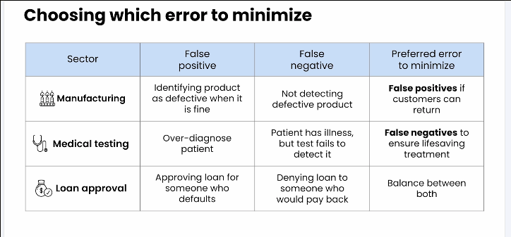

## Module 4: Hypothesis Testing

📄 [Slides](./C2_M4.pdf)

-----

### Introduction

🎥 [64 module 4 introduction W4 L1](https://www.youtube.com/watch?v=VdS41ltl22k)  

----

### Hypothesis Testing for Means

🎥 [65 demo hypothesis testing in action W4 L2](https://www.youtube.com/watch?v=uJQPdjtcDJw)  
🎥 [66 hypothesis testing means W4 L2](https://www.youtube.com/watch?v=t1ozfQv-0mQ) 

**Hypothesis testing** is a method used to make inferences about a population based on a sample of data. The process involves setting up two competing hypotheses, the null hypothesis and the alternative hypothesis. 

- The **null hypothesis** is the default assumption that there is no effect or no difference. 
- The **alternative hypothesis** is the hypothesis that there is an effect or a difference. The goal of hypothesis testing is to determine whether the data provide enough evidence to reject the null hypothesis in favor of the alternative hypothesis.


It works under certain conditions:
- Data is a representative sample, ideally from a random sample.
- Observations are independent.
- Normal distribution or the sample size is large enough to use the Central Limit Theorem.


🎥 [67 the hypothesis W4 L2](https://www.youtube.com/watch?v=fRbbCWo_agY) 

**Null Hypothesis:** 
$$H_0: \mu = \mu_0$$  
**Alternate Hypothesis:** 
$$H_1: \mu \neq \mu_0$$

where $\mu$ is the population mean and $\mu_0$ is the hypothesized population mean.

| Test Outcome | Statement | Conclusion |
| -------- | -------- | -------- |
| Evidence for $H_{1}$ | We reject the null hypothesis| Null Hypothesis is likely not true |
| No evidence for $H_{1}$ | We fail to reject the null hypothesis | Not enough evidence to reject the null hypothesis |


🎥 [68 identifying the hypothesis and test type W4 L2](https://www.youtube.com/watch?v=pA0J8iAz518)  

**Alternate Hypothesis:**  
- Right tailed test 
   $$H_1: \mu > \mu_0$$
- Left tailed test 
   $$H_1: \mu < \mu_0$$
- Two tailed test
    $$H_1: \mu \neq \mu_0$$

🎥 [69 calculating the test statistic W4 L2](https://www.youtube.com/watch?v=rGS3AMZCdUY)

**Test statistics** are used to determine whether the null hypothesis should be rejected. The test statistic is a standardized value that measures how far a sample statistic is from the null hypothesis value.

$$t = \frac{\bar{x} - \mu_0}{\frac{s}{\sqrt{n}}}$$

where $\bar{x}$ is the sample mean, $\mu_0$ is the hypothesized population mean, $s$ is the sample standard deviation, and $n$ is the sample size.

🎥 [70 determining the significance level and rejection region W4 L2](https://www.youtube.com/watch?v=0UXAxLXCjvg) 

**Level of Significance** ($\alpha$) defines strength of evidence required to reject $H_0$. It tells about incorrect rejection of null hypothesis. 

- Large alpha: More likely to reject $H_0$.
- Small alpha: Less likely to reject $H_0$, requires more evidence to reject null hypothesis.

$$ \alpha - 1 - \text{Confidence Level} $$
$$ \alpha = P(\text{Type I Error}) $$


🎥 [71 calculating the p value W4 L2](https://www.youtube.com/watch?v=qxqv4sNP0Ag)  

**P-value** is the probability of observing a test statistic as extreme as the one calculated from the sample data, assuming the null hypothesis is true.

- If p-value is less than $\alpha$, reject $H_0$, the event is expected happen less than $\alpha$.
- If p-value is greater than $\alpha$, fail to reject $H_0$.
- Smaller p-value indicates stronger evidence against $H_0$.
- P-value is not the probability of $H_0$ being true or false.


🎥 [72 demo hypothesis testing for means W4 L2](https://www.youtube.com/watch?v=cPMItAqVrqI)  

```excel
=NORM.S.DIST(test_stat, TRUE)

=Z.TEST(data, VALUE) +N("RIGHT TAILED TEST")

=NORM.S.DIST()
```

🎥 [73 hypothesis testing errors W4 L2](https://www.youtube.com/watch?v=9Q9cqKkhzdw) 

**True  Negative** (TN) - Correctly accept null hypothesis.

**False Positive** (FP) - Incorrectly reject null hypothesis.

**False Negative** (FN) - Incorrectly accept null hypothesis.

**True Positive** (TP) - Correctly reject null hypothesis.

We consider rejecting null hypothesis to be positive.

| Conclusion | $H_{0}$ is real true | $H_{0}$ is real false |
| -------- | -------- | -------- |
| Reject $H_{0}$ | Flae Positive | True Positive |
| Fail to reject $H_{0}$ | True Negative | False Negative |

**Type I Error** - Same as false positive rate. Rejecting null hypothesis when it is true.  
**Type II Error** - Same as False Negative. Accepting null hypothesis when it is false.



- For manufacturing aim to reduce the false positive rate, which claims product is defective but actually it is not.   
- For medical aim to reduce the false negative rate, which claims person is fine but actually have disease.

🎥 [74 the t distribution W4 L2](https://www.youtube.com/watch?v=8nR9sgGUdpc)  

**T-distribution** is a probability distribution that is used to estimate population parameters when the sample size is small and/or the population standard deviation is unknown. The t-distribution is similar to the normal distribution but has heavier tails, which makes it more robust to outliers.

It require more evidence to reject the null hypothesis.

**Lesson 1 Quiz**  
❓ [Quiz 1](quiz/l1_quiz.png)  
✅ [Quiz 1 Solutions](./graded_sol.md#quiz-1-solution)

**Practice Lab - Part 3**  
📊 [C2M4_PracticeLab_1](https://docs.google.com/spreadsheets/d/1xKzvXgPbL3zwqVGNpZwx6w7oEUW71rM9Ag1p5zLZNRY/edit?usp=sharing)

-----

### Other Hypothesis Tests

🎥 [75 hypothesis testing for proportions W4 L3](https://www.youtube.com/watch?v=2h4eqDYnSfU)  

z-statistic is used to test the hypothesis about the population proportion. It is calculated as:

$$z = \frac{\hat{p} - p_0}{\sqrt{\frac{p_0(1-p_0)}{n}}}$$

where $\hat{p}$ is the sample proportion, $p_0$ is the hypothesized population proportion, and $n$ is the sample size.

🎥 [76 demo hypothesis testing for proportions W4 L3](https://www.youtube.com/watch?v=Ryn1U9VnTQI)  

```
=1-NORM.S.DIST(z)
```

🎥 [77 two sample tests W4 L3](https://www.youtube.com/watch?v=kZMHF_zyoNI)  

**Two Sample** Tests are used to compare the means of two independent samples. The test statistic is calculated as:

$$t = \frac{\bar{x}_1 - \bar{x}_2}{\sqrt{\frac{s_1^2}{n_1} + \frac{s_2^2}{n_2}}}$$

where $\bar{x}_1$ and $\bar{x}_2$ are the sample means, $s_1$ and $s_2$ are the sample standard deviations, and $n_1$ and $n_2$ are the sample sizes.

Null Hypothesis:
$$H_0: \mu_1 = \mu_2$$

Alternate Hypothesis:
$$H_1: \mu_1 \neq \mu_2$$

```excel
=T.TEST(data1, data2, tails, type)
```
type: 1 - Paired, 2 - Two sample equal variance, 3 - Two sample unequal variance  
tail: 1 - one tail, 2 - two tail


🎥 [78 other hypothesis tests W4 L3](https://www.youtube.com/watch?v=vJdoTKc6mNo)  

**ANOVA** (Analysis of Variance) is used to compare the means of three or more independent samples. The test statistic is calculated as:

$$F = \frac{MS_{\text{between}}}{MS_{\text{within}}}$$

where $MS_{\text{between}}$ is the mean square between groups and $MS_{\text{within}}$ is the mean square within groups.

**Paired t-test** is used to compare the means of two dependent samples. The test statistic is calculated as:

$$t = \frac{\bar{d}}{\frac{s_d}{\sqrt{n}}}$$

where $\bar{d}$ is the sample mean of the differences, $s_d$ is the sample standard deviation of the differences, and $n$ is the sample size.

**Chi-Square Test** is used to test the independence of two categorical variables. The test statistic is calculated as:

$$\chi^2 = \sum \frac{(O - E)^2}{E}$$

where $O$ is the observed frequency and $E$ is the expected frequency.

**Goodness of fit test** is used to test whether the observed frequency distribution of a variable matches the expected frequency distribution. The test statistic is calculated as:

$$\chi^2 = \sum \frac{(O - E)^2}{E}$$

where $O$ is the observed frequency and $E$ is the expected frequency.


🚨 **Important Points**  
- when you calculate a confidence interval for a population mean, you are not saying that the true mean is within this range with absolute certainty. Rather, you are stating that if you were to take many samples and calculate a confidence interval for each, a certain percentage (e.g., 95%) of those intervals would contain the true mean. This subtle but important distinction underscores the probabilistic nature of statistical inference.
- It is tempting to interpret a 95% confidence interval as the range within which 95% of the data falls. However, this is incorrect. The correct interpretation is that you are 95% confident that the interval contains the true population parameter.
- hypothesis testing does not prove a hypothesis to be true or false. Instead, it evaluates the strength of the evidence against a null hypothesis. When you reject the null hypothesis, you are not proving that the alternative hypothesis is true. You are merely stating that the observed data is unlikely to have occurred if the null hypothesis were true.
- Statistical testing does not prove hypotheses; it only provides evidence for or against them. Rejecting the null hypothesis suggests support for the alternative hypothesis but does not prove it.

**Lesson 2 quiz**  
❓ [Quiz 2](quiz/l2_quiz.png)  
✅ [Quiz 2 Soluion](quiz/l2_quiz_sol.png)

**Practice Lab: Part 4**  
📊 [C2M4_PracticeLab_2]()


-----

### LLMs for Hypothesis Testing


🎥 [79 interpretation with llms W4 L4](https://www.youtube.com/watch?v=JAzzzUB2pmU)  
🎥 [80 inference with llms W4 L4](https://www.youtube.com/watch?v=lrqWSyn4r7s)  

-----

### Graded Quiz

**Q1**: In which three scenarios would a two-sample hypothesis test be most appropriate? (Select all that apply)  
- [ ] A/B testing in product development  
- [ ] Clinical research with experimental and control groups  
- [ ] Testing whether average hours of sleep per night is greater than 8  
- [ ] Comparing rural and urban opinions on AI  
- [ ] Testing whether the average pH of a sample of beverages is less than 7  

**Q2**: What does the "rejection region" represent in a hypothesis test?  
- [ ] The range of values that lead you to reject the null hypothesis  
- [ ] The range of values that support the null hypothesis  
- [ ] The average values expected under the null hypothesis  
- [ ] The middle 95% of the distribution  

**Q3**: Which two of the following are required conditions for hypothesis tests to work effectively? (Select all that apply)  
- [ ] The data must be a representative sample, ideally a random sample.  
- [ ] The data must have low variance.  
- [ ] The sample mean must be equal to the population mean.  
- [ ] The data must be normally distributed or have a large sample size.  

**Q4**: What does it mean if you "reject the null hypothesis"?  
- [ ] The data suggest that the null hypothesis is likely not true.  
- [ ] The null hypothesis is absolutely false.  
- [ ] The alternative hypothesis is proven.  

**Q5**: In which two of the following scenarios might you choose to use the t distribution instead of the normal distribution in hypothesis testing? (Select all that apply)  
- [ ] When the population standard deviation (σ) is unknown.  
- [ ] When the sample size is small (typically n < 30)  
- [ ] When you want to use the simplest calculation  
- [ ] When the sample size is large (n > 1000)  

**Q6**: What does it mean if a hypothesis test concludes that the difference between two means is statistically significant?  
- [ ] The difference likely reflects a genuine difference between the population means.  
- [ ] The two population means are likely equal to each other.  
- [ ] The observed difference between the two sample means is likely due to random chance.  
- [ ] The two means are both different from the hypothesized value.  

**Q7**: Your client, a pharmaceutical company, needs to determine if their new drug significantly decreases pain levels among patients with a particular disease. The current average pain level for patients with the disease is 5.47. What set of hypotheses would be most appropriate for this test?  
- [ ] H₀ (null): μ = 5.47 H₁ (alternative): μ < 5.47  
- [ ] H₀ (null): μ < 5.47 H₁ (alternative): μ = 5.47  
- [ ] H₀ (null): μ = 5.47 H₁ (alternative): μ ≠ 5.47  
- [ ] H₀ (null): μ = 5.47 H₁ (alternative): μ > 5.47  

**Q8**: You are working with a defense contractor on a safety-critical application, so you've chosen to use a 99% confidence level for your relevant hypothesis tests. What tradeoff are you making by choosing such a high level of confidence?  
- [ ] You require stronger evidence to detect an effect, so you may not detect a true effect.  
- [ ] You require less evidence to detect an effect, so false positives are more likely.  
- [ ] Your chosen confidence level of 99% is more difficult to explain to stakeholders than a typical 95% confidence level.  
- [ ] Your sample size will decrease, so you may have fewer observations to work with.  

**Q9**: In which scenario would a one sample test for proportions be more appropriate than a one sample test for means?  
- [ ] A company wants to test whether the percent of defective products in a batch is greater than 5%.  
- [ ] A researcher wants to determine if the average height of a population differs from a known value.  
- [ ] A scientist is testing whether the mean weight of a certain species of fish has changed over time.  
- [ ] A teacher wants to compare the average test scores of students in two different classrooms.  

**Q10**: Which test is most suitable for analyzing categorical data to determine if there is a relationship between variables?  
- [ ] Chi-squared test  
- [ ] ANOVA  
- [ ] Paired t test  
- [ ] Goodness of fit test


✅ [Graded Quiz Solution](./graded_sol.md#graded-quiz)


-----


### Graded Lab

📊 [C2M4_GradedLab](https://docs.google.com/spreadsheets/d/1hex54rKilfHaZYTnyuY7ERwBmgU1HA8FYaYBi6zmxdE/edit?usp=sharing)

**Question 1**: What test type is most appropriate to calculate the mean price of all diamonds in Exercise 1?  
- [ ] two-tailed  
- [ ] left-tailed  
- [ ] right-tailed  
- [ ] zero-tailed  

**Question 2**: What is the p-value associated with this test?  
- [ ] 0.0228  
- [ ] 0.1110  
- [ ] -0.0057  
- [ ] 0.0489  

**Question 3**: In Exercise 2, you tested whether the mean price of 'Premium' cut diamonds is higher than that of 'Fair' cut diamonds. Which set of hypotheses correctly tests this question?  
- [ ] H₀ (null): μ_premium = μ_fair, H₁ (alternative): μ_premium > μ_fair  
- [ ] H₀ (null): μ_premium = μ_fair, H₁ (alternative): μ_premium ≠ μ_fair  
- [ ] H₀ (null): μ_premium = μ_fair, H₁ (alternative): μ_premium < μ_fair  
- [ ] H₀ (null): μ_premium ≠ μ_fair, H₁ (alternative): μ_premium = μ_fair  

**Question 4**: Referring to Exercise 2, what is the p-value for the test that compares the mean price of 'Premium' and 'Fair' diamonds?  
- [ ] 0.2602  
- [ ] 0.0001  
- [ ] 0.3108  
- [ ] 1.559  

**Question 5**: Referring to Exercise 2, what can you conclude from your calculated p-value?  
- [ ] There is not enough evidence to reject the null hypothesis that the means are the same.  
- [ ] You have proven the null hypothesis.  
- [ ] The means of the two cuts are the same.  
- [ ] You reject the null hypothesis that the means are the same.  
- [ ] You have proven the alternative hypothesis.  

**Question 6**: Referring to Exercise 3, calculate the difference between the average price_per_carat for Fair and Premium diamonds. Subtract x̄ (Fair) from x̄ (Premium) of the price_per_carat feature.  
- [ ] $891.91  
- [ ] $75.89  
- [ ] $1,044.09  
- [ ] $643.30  

**Question 7**: Referring to Exercise 3, calculate the difference between the average carat for Fair and Premium diamonds. Subtract x̄ (Fair) from x̄ (Premium) of the carat feature.  
- [ ] -0.172  
- [ ] 0.414  
- [ ] -3.188  
- [ ] -1.454  

**Question 8**: Based on the hypothesis test you conducted in Exercise 3, where you compared the mean carat of 'Premium' and 'Fair' diamonds, which two statements below are true?  
- [ ] You can reject the null hypothesis.  
- [ ] You don't have enough evidence to reject the null hypothesis.  
- [ ] You performed a one-tailed test.  
- [ ] You performed a two-tailed test.  

**Question 9**: In Exercise 4, can you reject the null hypothesis that the proportion of 'Ideal' or 'Premium' cut diamonds makes up 67% of the shipment?  
- [ ] Yes  
- [ ] No  

**Question 10**: Based on the hypothesis test results for cut proportions, which of the following statements best communicates an appropriate recommended action to your stakeholders?  
- [ ] The proportion of the two cuts is as expected, so no changes to inventory management are necessary.  
- [ ] Adjust inventory strategies to focus more on premium or ideal cut diamonds.  
- [ ] Remove all fair cut diamonds from the batch to focus only on premium or ideal cuts.  
- [ ] Increase the proportion of premium or ideal cut diamonds in the new batch to improve inventory composition.

✅ [Graded Lab Solution](./graded_sol.md#graded-lab)

------

### Capstone 

📊 [C2_Capstone](https://docs.google.com/spreadsheets/d/1Fnmtomki66mV1AHiLCCrzln4IFXMsi0B4JUqqpQn0Ho/edit?usp=sharing)

**Q1**: What distribution does the feature maxheartrate most closely resemble?  
- [ ] Bernoulli  
- [ ] Binomial  
- [ ] Uniform  
- [ ] Normal  

**Q2**: Which two of the following features appear to have a negative skew?  
- [ ] age  
- [ ] maxheartrate  
- [ ] oldpeak  
- [ ] fbs  

**Q3**: In what range (approximately) would you expect 68% of the maxheartrate values to be? Assume that the distribution is normal.  
- [ ] 126-172 BPM  
- [ ] 129-175 BPM  
- [ ] 150-155 BPM  
- [ ] 149-152 BPM  

**Q4**: Which diagnosis group (sick or healthy) has a higher proportion of patients with fasting blood sugar (fbs) = 1?  
- [ ] Healthy (diagnosis = 0y)  
- [ ] Sick (diagnosis = 1)  
- [ ] Both groups have the same average fasting blood sugar  
- [ ] You cannot calculate proportion of patients with fbs = 1  

**Q5**: What is the difference between the average maxheartrate of sick patients and the average maxheartrate of healthy patients?  
- [ ] The sample mean of maxheartrate is about 19.5 beats per minute higher for sick patients.  
- [ ] The sample mean of maxheartrate is about 19.5 beats per minute lower for sick patients.  
- [ ] The sample mean of maxheartrate is about 11.5 beats per minute higher for sick patients.  
- [ ] The sample mean of maxheartrate is about 11.5 beats per minute lower for sick patients.  

**Q6**: Generally speaking, would you expect the margin of error for your 95% confidence interval to increase or decrease if you get your hands on a lot more data, and why?  
- [ ] Decrease, because the margin of error is divided by the square root of the sample size.  
- [ ] Increase, because the variability increases the more samples you have.  
- [ ] Increase, because you will halve your sample size.  
- [ ] Decrease, because the margin of error is divided by the sample mean.  

**Q7**: You are working on delivering your results to the group of physicians. As part of your report, you will carefully explain the meaning of your 95% confidence interval, to avoid potential misinterpretation. What do the upper and lower limits of confidence intervals correspond to in your statistical analysis?  
- [ ] They represent the exact values of the population parameter.  
- [ ] They indicate the range of values within which future observations will fall.  
- [ ] They define the range in which the true population parameter is expected to lie with a certain level of confidence.  
- [ ] They show the probability of 5% of events occurring within the interval.  

**Q8**: One of the physicians has approached you to ask about the possibility of simulating data for additional patients. Which of the following describes the main benefit of simulation in this case?  
- [ ] You can quickly and easily generate many possible scenarios, without having to identify more sick and healthy patients.  
- [ ] You can be 100% confident in your conclusions based on the simulated data.  
- [ ] You will be able to destroy the data you have collected, since you no longer need any real data.  
- [ ] You can be certain that your data will always follow a normal distribution when simulating it.  

**Q9**: The test for comparing the means of maxheartrate that you performed in exercise 3 is a **____**, and has a p-value of **_____**. This means that you **____** reject the null hypothesis with any reasonable significance level.  

**Q10**: The physicians have asked you to conduct further analysis on the cholesterol feature. Which set of hypotheses would be appropriate if you wanted to conduct a two-sided test comparing the means of cholesterol between sick and healthy patients?  
- [ ] Null hypothesis: mu_sick = mu_healthy; Alternative hypothesis: mu_sick > mu_healthy  
- [ ] Null hypothesis: mu_sick = mu_healthy; Alternative hypothesis: mu_sick < mu_healthy  
- [ ] Null hypothesis: mu_sick = mu_healthy; Alternative hypothesis: mu_sick ≠ mu_healthy  
- [ ] Null hypothesis: mu_sick ≠ mu_healthy; Alternative hypothesis: mu_sick > mu_healthy

✅ [Capstone Solution](./graded_sol.md#capstone-project)

------

### Course Wrap-up

🎥 [81 your next steps W4 L7](https://www.youtube.com/watch?v=ws1UOLk8DNM)  

